# OEMDisplay-Tandy

**Five graphics modes, experimental hardware text mode, a compact Start-menu
shell, games and utilities for Windows 3.0 real mode on the original 8088
Tandy 1000 EX/HX.**

Bring Tandy graphics to a 640 KB Windows desktop: launch your Program Manager
apps from Start, click cookies, swat flies, play pinball, watch Matrix rain,
or convert a GIF for Paintbrush.

[Current trial guide](docs/TRIAL4/README.MD) | [App test pack](examples/TANDYLAB/README.MD) |
[Development status](docs/STATUS.MD) | [Companion sound project](https://github.com/astrobleem/oemsound-tandy)

## Five graphics display modes

| Resolution | Colors | Driver | Desktop |
| --- | ---: | --- | --- |
| 160x200 | 16 | `TNDY160.DRV` | Smallest desktop, full Tandy palette |
| 320x200 | 4 | `TNDY3204.DRV` | Black, cyan, magenta and white |
| 320x200 | 16 | `TANDY88.DRV` | Default profile, full Tandy palette |
| 640x200 | 2 | `TNDY6402.DRV` | Wide black-and-white desktop |
| 640x200 | 4 | `TNDY6404.DRV` | Wide desktop, black/red/green/white |

Select a mode through Windows Setup's **Other display** menu and restart.
Each profile includes matching fonts. All modes have 200 logical rows;
stock dialogs can clip at narrow widths. Original EX/HX 640x200 mode has four
colors, not sixteen. [Mode guide](docs/MODES.MD).

The five choices in Windows Setup, captured in the emulator.

## Experimental 80x25 hardware text mode

A separate [text-mode proof](experiments/TEXTMODE/README.MD) runs unchanged
Windows 3.0 Program Manager and Notepad in actual BIOS mode 03h: 80x25
character/attribute cells with 640x200 logical GDI pixels. Notepad text is
readable and survives full repaint; sampled pixel, XOR and copy checks pass.

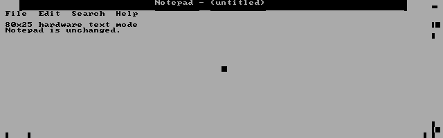

Recorded Notepad proof, decoded from the emulator's hardware text cells.
This frame shows readable text; it does not establish general compatibility.

**Lab-only, not ready for everyday use.** Window movement, clipping, caret
inversion and bitmap restore can corrupt characters, and small icon labels
remain approximate. Physical hardware and speed are untested. Keep it out of
normal Windows installations and OEM/Setup disks. See the
[measured results and failures](experiments/TEXTMODE/EVIDENCE/RESULT.JSON).

## Driver features

- **8088-safe drawing copies:** corrected runtime-generated copy sequences
  and instruction audits for the original 8086/8088 target.
- **Smaller redraws:** bounded dirty-region refresh for proven BitBlt,
  SetPixel and plain-text cases; read-only queries avoid needless screen copies.
- **Cursor retention:** preserve an unaffected cursor, with bounded refresh
  retries and safe hide/restore when drawing overlaps it.
- **Faster Output paths:** proven thin lines and solid scan intervals refresh
  bounded row ranges. Uncertain cases keep the full refresh path.
- **Palette and bitmap support:** mode-specific colors, compatible bitmaps,
  bounded BI_RGB conversion and Paintbrush save/reopen support.
- **Guarded startup:** shared-video-memory reservation before Windows or Setup.
- **Native OEM installation:** matching fonts and a custom Tandy startup screen,
  installed through Setup.

The optimized development drivers and older packaged binaries are separate.
Use the [current trial guide](docs/TRIAL4/README.MD) for new hardware trials;
build/package identities and rendering limits are in [development status](docs/STATUS.MD).

The custom startup screen from the OEM/splash emulator checkpoint.

## Tandy Start / TSHELL

[TSHELL](examples/TSHELL/README.MD) adds a compact Start menu and clock bar:

- **My Computer:** directly on Start; opens File Manager, brings its existing
  window forward, and restores it when minimized.
- **Programs:** read-only import of existing Windows 3.0 Program Manager groups,
  paging, saved command arguments and working directories.
- **Run / Browse:** launch programs from their own folders.
- **System / About This Tandy:** compact system, display and memory pages.
- **Adjust date/time:** right-click the clock for a compact date/time editor,
  with validation, Apply, Reload and Cancel; fits the 160-pixel desktop.
- **Clock shortcut:** double-click the clock to open Clock, or Calendar as fallback.
- **Screen saver chooser:** Start / System / Screen saver selects None, Matrix,
  Maze or Starfield, with a 10–3600 second delay, Apply and unsaved Preview.
  Starfield Options offers three speeds and 16, 32 or 64 stars. Other-app input
  resets idle; menus, held input and known audio tools defer automatic launch.
- **Startup sounds:** Tandy, XP-note arrangement or none; optional pre-exit sound.
- **Normal or silent exit:** preserves application save prompts and exit vetoes.
- **DOS launch/recovery helpers:** restore the original shell after Windows returns
  while preserving unrelated settings.
- **Moon-and-stars DOS farewell:** after a successful Windows return and verified
  shell restoration, BIOS text artwork appears above the usable DOS prompt.
  No ANSI.SYS is needed; it does not power off the machine.

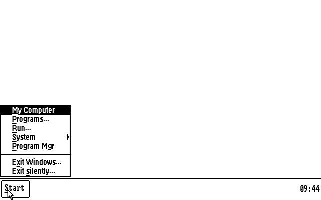

Retained version 09 capture on a logical 640x200 monochrome desktop.
The corrected placement remains in 10, whose System menu adds Screen saver.

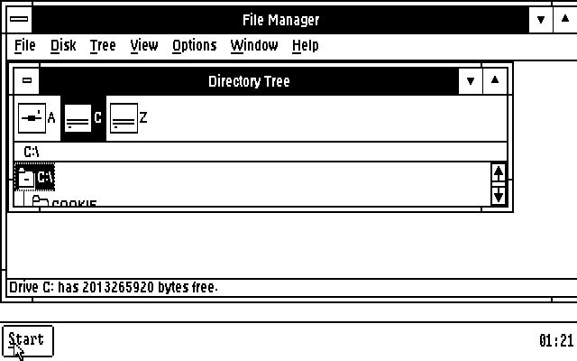

My Computer opens the installed Windows File Manager or restores its existing
window. File Manager remains a stock Windows app; it is not bundled here.

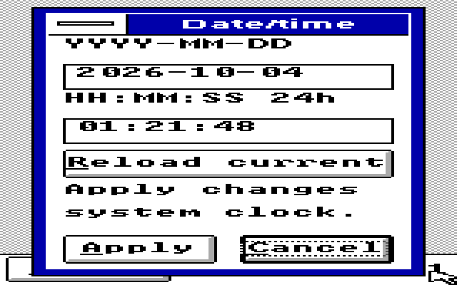

Right-click the clock to edit date and time in a dialog that fits 160x200.

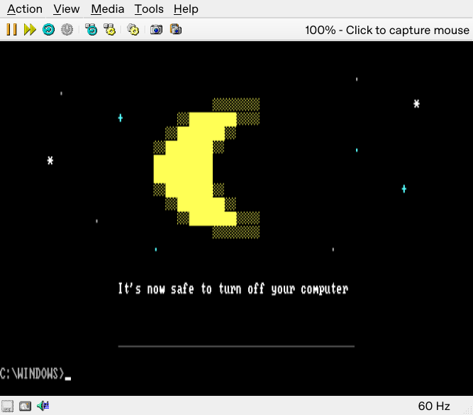

The successful DOS farewell in 86Box. Errors and recovery failures retain plain
diagnostics; the artwork never substitutes for successful shell restoration.

Version 10 adds the graphical saver chooser, compatible Maze saver and GDI
Starfield to the date/time editor, My Computer, success-only DOS farewell and
corrected Start-menu placement. Matching
first-party source and runtime files are included in this branch. Upgrade
instructions and exact verification scope are in [development status](docs/STATUS.MD).

Program Manager remains the group editor. TSHELL is a compact shell experiment;
maximized apps can cover its bar, and the idle saver is not a password lock.
[Launch, upgrade and recovery guide](examples/TSHELL/README.MD).

### Choose a screen saver

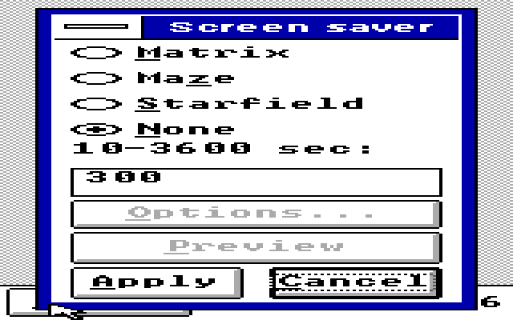

Current TSTART10 settings on the logical 160x200 desktop. Preview does not
save; Apply saves and updates the primary shell. None disables automatic
launch. Secondary bars save for the next primary startup.

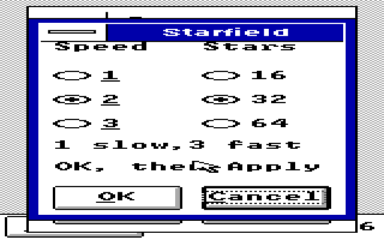

Options are staged until Apply. Cancel discards unapplied changes.

Current Starfield in 640x200 monochrome. This still frame does not demonstrate
animation speed. Maze remains experimental and can be very slow; 16 stars is
Starfield's lightest setting. Physical performance is unmeasured.

## Games, visuals and utilities

| App | What it does |
| --- | --- |
| [Cookie Clicker](examples/COOKIE/README.MD) | Click or Space earns cookies; buy cookies/second upgrades; New, Save, Load and About menus; fits 160x200. |
| [Fly Swat 1.1](examples/SWAT/README.MD) | Mouse-controlled fly hunting, score, three hearts, pause and restart; visible white swatter with black outline; fullscreen and windowed paths, with `/G` fallback. |
| [Matrix](examples/MATRIX/README.MD) | Fullscreen character rain, input dismissal and desktop restoration; on-demand animation or TSHELL `/S` idle companion. |
| [Maze saver](examples/MAZE/SAVER10/README.MD) | Experimental raycasting saver with native presentation on canonical drivers and clipped GDI fallback on trial aliases; very slow on approximate-XT settings. Ordinary windowed mode remains available. |
| [Starfield](examples/STARFLD/README.MD) | GDI flying-star saver with three speeds, 16/32/64 stars, input dismissal and guarded cursor/focus handoff. |
| [Pinball](examples/PINBALL/README.MD) | Two flippers, three bumpers, three balls and score; Space launches, Z/Left and / or Right flip, P pauses; focus loss pauses. |
| [Slosh](examples/SLOSH/README.MD) | Drag the title bar and watch the small spring-surface water toy rebound and settle. |
| [GIFLOAD](examples/GIFLOAD/README.TXT) | Convert supported static GIFs to new palette-mapped BMPs, then open in Paintbrush; does not change Paintbrush's format list. |
| [COMMDLG demo](examples/COMMDLG/README.TXT) | Original bounded Open/Save dialogs, extended-error and file-title APIs; app-local Windows 3.0 preview, with the pack's CDSTART launcher. |
| [FileDrop demo](examples/FILEDROP/README.TXT) | Drag one or two path names between sender/receiver apps; Escape cancels. Transfers names, not files. |
| [Brighter Tomorrow](examples/BRIGHT/README.MD) | Five workplace notices, choices, three visible metrics, receipts, two endings and Restart; compact keyboard/native-button game. |
| [About This Tandy](examples/TABOUT/README.MD) | System, Display and Memory pages with refresh and keyboard navigation; exact hardware model remains unknown, with probing deferred. |
| [EXJOY](examples/EXJOY/README.MD) | Left/right raw joystick axis counts, buttons, live/range views and session-only center calibration. |
| [DOS WHEEL diagnostic](tools/WHEEL/README.TXT) | Bounded DOS mouse-wheel/API and raw serial diagnostics. Raw Genius protocol detected; Windows scrolling bridge not implemented. |

| Cookie Clicker - 320x200x16 | Pinball - 640x200x4 |
| --- | --- |
| 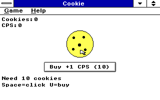 | 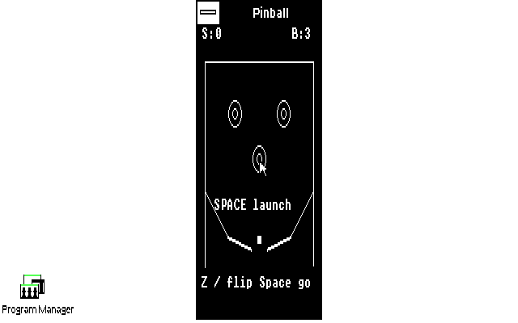 |

| Matrix - 320x200x16 | Slosh - logical 160x200x16 |
| --- | --- |
| 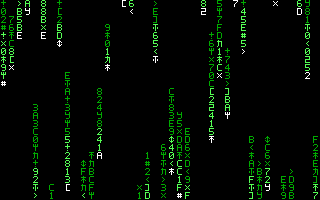 | 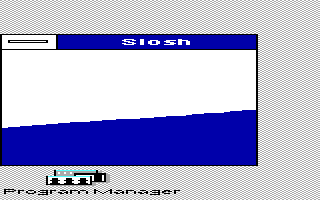 |

| Maze - windowed proof | Native Solitaire - 640x200x4 |
| --- | --- |
|  |  |

Actual emulator captures. Solitaire is a stock Windows compatibility example,
not an included game. Some images duplicate rows/columns for display aspect;
[capture sources and scope](docs/SHOTS/README.MD) retain their original provenance.

The [TANDYLAB catalog](examples/TANDYLAB/CATALOG.TXT) also includes PSGPLAY,
Beats, Automatic Mouth and startup/exit chimes from the
[sound project](https://github.com/astrobleem/oemsound-tandy).

## Hardware status and installation

The project is experimental, with emulator evidence and scoped reports from
a genuine 8088 Tandy 1000 EX running DOS 6.22 and Windows 3.0 real mode.
TRIAL 3 monochrome was reported substantially faster, and a later 320x200x16
trial ran Paintbrush and TSHELL. A low-resolution 16-color report did not
identify the exact mode. The 320x200 four-color report noted red hearts mapping
to black. Automatic screensaver operation was also reported working; its exact runtime
hash was not read back. Physical 640x200 four-color behavior and joystick input
remain open.
[Detailed status and limits](docs/STATUS.MD).

Use a backed-up **Windows 3.0 real-mode / 640 KB** installation. For current
drivers, follow the [trial/rollback guide](docs/TRIAL4/README.MD). The older
[TANDY88.ZIP](TANDY88.ZIP) remains a historical OEM package; its installation
uses `INSTALL`, then `C:\TANDY88\TANDY88 SETUP` and **Other display**.

**Always use the guarded launcher, including for Setup and lower-color modes.
Never bypass a failed video-memory reservation by starting WIN directly.**
Use Setup for mode changes rather than manual SYSTEM.INI edits.

[Installation details](README.TXT) | [Build guide](BUILDING.MD) |
[Verification and compatibility limits](docs/STATUS.MD) |
[Source provenance](src/tandysw/PROVENANCE.md)

Contributions and hardware testing are welcome. Include app/driver versions,
machine, DOS/Windows versions and reproducible steps, distinguishing hardware
from emulator results. Preserve existing third-party notices.

