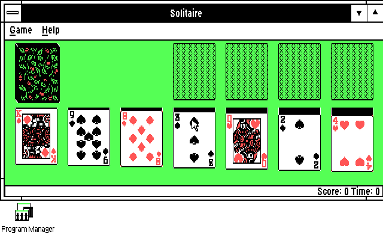

# OEMDisplay-Tandy

**Five selectable Windows 3.0 real-mode display drivers for the original
8088-based Tandy 1000 EX/HX with 640 KB RAM.**

Choose your resolution and color depth through Windows Setup. The package
includes matching fonts, a custom Tandy startup screen and a guarded DOS
launcher. Tested in DOSBox-X with 8086/8088 instruction-set enforcement and
normal 640 KB memory; physical Tandy hardware remains untested.

**[Download TANDY88.ZIP](TANDY88.ZIP)** · [Installation details](README.TXT) ·
[Verification and limits](docs/MODES.MD)

## Display modes

From the narrowest desktop to the widest:

| Resolution | Colors | Driver | Desktop trade-off |
| --- | ---: | --- | --- |
| 160×200 | 16 | `TNDY160.DRV` | Full palette, very limited width |
| 320×200 | 4 | `TNDY3204.DRV` | Black, cyan, magenta and white |
| 320×200 | 16 | `TANDY88.DRV` | Default; full Tandy palette |
| 640×200 | 2 | `TNDY6402.DRV` | Wide, black-and-white desktop |
| 640×200 | 4 | `TNDY6404.DRV` | Wide desktop with black, red, green and white |

**Start with 640×200, four colors for usable desktop width.** Choose the
320×200, sixteen-color default when color range matters more. Every mode has
200 vertical pixels; dialogs can clip at 160- and 320-pixel widths. Original
EX/HX hardware does not provide 640×200 with sixteen colors.

## In Windows 3.0

All seven Solitaire columns fit, with red and black suits on a green table.
This is an unmodified native emulator capture; doubled rows produce a 640×400
image of the logical 640×200 display. Launch, layout and colors were checked,
not a complete game. [Capture details](docs/modes/6404rg/CAPTURE.JSON).

See the [five choices in Windows Setup](docs/modes/oem/CHOICES.PNG) and the
[included custom startup screen](docs/splash/BOOT.PNG).
[Paintbrush after saving and reopening](docs/modes/oem/REOPEN.PNG).

## Install

You need a working **Windows 3.0 installation in `C:\WINDOWS`**. Back it up
first. On a new machine, install Windows with stock CGA before adding this
OEM display disk. The download includes its support files, but not Windows.

1. Extract [TANDY88.ZIP](TANDY88.ZIP). Copy the contents of `DISK1` to a
   360 KB floppy or a DOS-accessible directory.
2. Exit Windows completely. At the DOS prompt, change to that directory and
   run `INSTALL` to install the helper and launcher in `C:\TANDY88`.
3. Run `C:\TANDY88\TANDY88 SETUP`. Choose **Display → Other display**, supply
   the OEM disk path and select a mode. Supply the same path if asked for a
   font or `TNDYLOGO.RLE`. Setup installs the driver, fonts and startup screen.
4. Start Windows with **`C:\TANDY88\TANDY88` on every boot**. The launcher
   reserves video memory before running Windows in real mode. The OEM disk
   is no longer needed for ordinary startup.

To change modes, exit Windows and repeat step 3 with the OEM disk, then restart
through the launcher. No manual `SYSTEM.INI` edits or source build are needed.
For another Windows directory or troubleshooting, read [README.TXT](README.TXT).

## Requirements and known limits

- **DOS 3.0 or newer**, with the required allocation functions, and the normal
  **640 KB Tandy shared-memory layout** in which the BIOS reports 624 KB.
  Start from DOS text mode 3.
- Always use the supplied launcher, including for Setup and lower-color modes.
  **Do not bypass a reservation failure by running `WIN` directly.** Unsupported
  memory layouts are rejected. [Memory requirements](src/tandysw/RESERVE.MD).
- Windows 3.0 **real mode** is the target. Windows 3.1, protected modes, PCjr
  and expanded-memory configurations are outside the validated target.
- Physical Tandy hardware, genuine MS-DOS variants and cycle-exact 8088 timing
  have not been validated. Emulator tests do not establish hardware performance.
- Large redraws can be slow. Application coverage and bitmap support are not
  exhaustive; see the [mode test record](docs/MODES.MD) and
  [bitmap limits](src/tandysw/DIB88.MD).

## Development and evidence

- [Build and packaging guide](BUILDING.MD)
- [Current driver source and test tools](src/tandysw/README.md)
- [Mode coverage and verification](docs/MODES.MD)
- [OEM installation and package evidence](docs/OEMDISK.MD)
- [Source provenance](src/tandysw/PROVENANCE.md)

For bug reports, include the driver hash, DOS/Windows versions, machine or
emulator settings, reproduction steps, and whether you used real hardware.
The project includes existing Microsoft DDK material and Windows support
files; existing third-party notices are retained.
