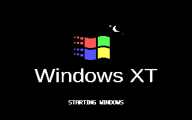
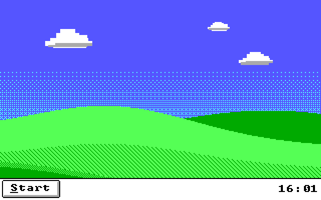
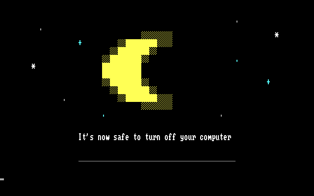
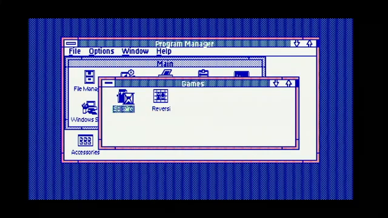
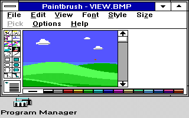
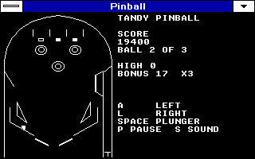
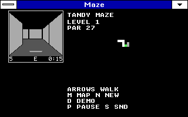
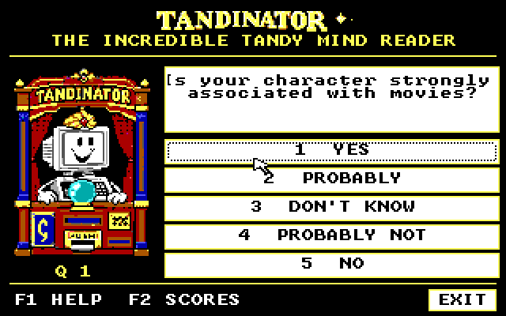

# Windows XT

Windows XT brings color graphics, a compact Start-menu desktop, games and
utilities to Windows 3.0 on the Tandy 1000 EX/HX.

| Startup | Desktop | Shutdown |
| --- | --- | --- |
|  |  |  |

[User manual](docs/USERMAN.MD) · [Downloads and installation](#get-started)

## Before and Windows XT

| Before: Windows 3.0, four colors | Windows XT: sixteen colors |
| --- | --- |
|  |  |

From [Chad's earlier video](https://www.youtube.com/watch?v=yNisFBDLXos&t=1230s).
Paintbrush in 320x200, with all 16 palette colors. Different modes; appearance comparison. [Capture details](docs/PROMO/SHOWCASE.MD#earlier-windows-30-video).

## Features

- Five graphics modes, including 320x200 in 16 colors.
- Tandy Start: Programs, My Computer, Run/Browse and a clock.
- Long filename browsing for existing names on supported DOS 6.22 FAT volumes.
- Games, screen savers, green hill wallpaper and optional
  [Tandy sound](https://github.com/astrobleem/oemsound-tandy).
- Short animated startup and a moon-and-stars shutdown screen.

Experimental software. Requires your own Windows 3.0 installation, DOS 3.3+
and a supported Tandy 1000 EX/HX with 640 KB RAM.

## Apps

| [Pinball](examples/PINBALL/README.MD) | [Maze preview](examples/MAZE/GAME/README.MD) | [Tandinator](examples/TANDINAT/README.MD) |
| --- | --- | --- |
|  |  |  |

Maze is a separate preview; the disk image includes the older saver.
[Cookie Clicker](examples/COOKIE/README.MD) and more are in the user manual.
[Capture details](docs/PROMO/SHOWCASE.MD).

## Get started

**[Download Windows XT 0.1.0-rc.3](https://github.com/astrobleem/oemdisplay-tandy/releases/tag/v0.1.0-rc.3)**
— [720 KB disk ZIP](https://github.com/astrobleem/oemdisplay-tandy/releases/download/v0.1.0-rc.3/WINXT720.ZIP)
or [disk image](https://github.com/astrobleem/oemdisplay-tandy/releases/download/v0.1.0-rc.3/WINXT720.IMG).

Back up Windows, then follow the [installation guide](tools/FLASHDISK/README.MD).
Use the guarded `C:\WINXT\WINXT` launcher after installation.

The [short animated startup](examples/WXTSPL/WAVE/README.MD) is enabled by
the guarded installer in Color mode; other modes retain static startup.
[Optional experimental downloads](https://github.com/astrobleem/oemdisplay-tandy/releases/tag/experiments-2026-10-07)
have their own installation guides.

## Display modes

| Resolution | Colors |
| --- | ---: |
| **320x200** | **16 — default** |
| 640x200 | 2 |
| 640x200 | 4 |
| 320x200 | 4 |
| 160x200 | 16 |

**Tandy Graphics II / ETGA 640x200x16: in development** for supported later
SL/TL/RL models. It is not shipped and cannot be used on EX/HX.

For mode details, the text-mode experiment, app guides, long filename
requirements and recovery, see the [user manual](docs/USERMAN.MD).
[Development status](docs/STATUS.MD) · [Build guide](BUILDING.MD)
