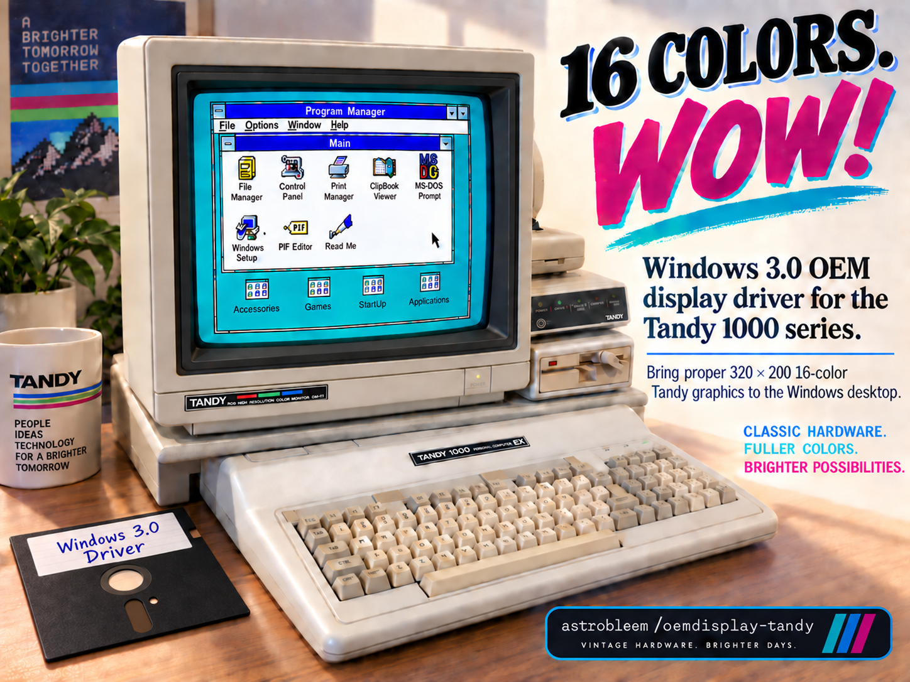
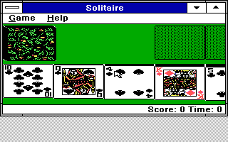
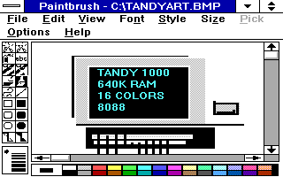
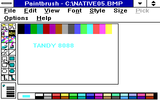
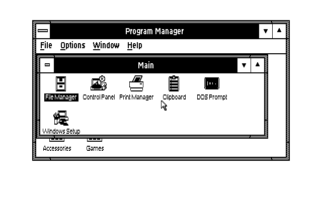
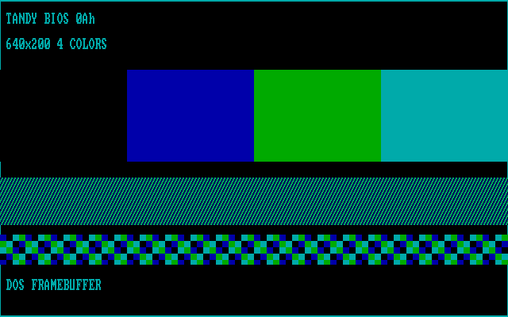
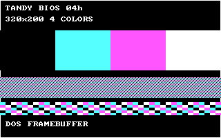
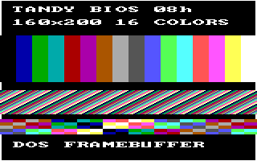

# OEMDisplay-Tandy



*Promotional artwork. Native emulator captures and verification details appear below.*

**Windows 3.0 real mode in 320×200, 16-color Tandy graphics, targeting the
8088-based Tandy 1000 EX/HX.**

The current milestone goes beyond a successful build: Windows boots to the
desktop, native Paintbrush draws in color and saves/reopens color BMPs, and
pixel-level tests verify the display output. The current driver is
`TANDY88.DRV` from [src/tandysw](src/tandysw/README.md).

**Status: emulator-verified correctness checkpoint (candidate05, October 2,
2026).** Tests enforce the 8086/8088 instruction set and use normal 640 KB
Tandy memory with a video-memory reservation helper. Physical Tandy hardware
and cycle-exact 8088 timing have not been tested.

[Download the ready-to-use OEM disk](TANDY88.ZIP) and follow
[Getting started](#getting-started).

## Solitaire on TANDY88



Actual Windows 3.0 Solitaire on the current driver: red and black suits remain
distinct on the green table. This unmodified native capture is 320×200.
The captured view clips the right side of the tableau: four full columns and
part of the fifth are visible. Launch, a new deal and suit colors are verified;
whole-game playability has not been tested.

## Native Paintbrush showcase



A stylized front-view Tandy, drawn inside Windows 3.0 Paintbrush using the
8088-compatible driver in DOSBox-X. This is the unmodified native 320×200
capture; the cyan lettering is part of the drawing. The drawing predates the
candidate05 bitmap-save fix, so it demonstrates native drawing rather than
save/reopen correctness.

The current candidate05 save/reopen test: a 200×120 image with all 16 colors
and newly entered cyan lettering, saved as a BMP and reopened in Paintbrush.
All **24,000 reopened canvas pixels** match the saved bitmap. The native capture
is included in the [mode showcase below](#resolution-and-color-depth-showcase);
see the [DIB correction and evidence](src/tandysw/DIB88.MD) for the full test.

## What works now

- Windows 3.00 real-mode desktop at 320×200, 16 colors, with BIOS mode 09h
- Native Paintbrush menus, text entry, color BMP save and reopen
- Uncompressed BI_RGB bitmap conversion at 1, 4, 8 and 24 bits per pixel,
  including tested clipping and partial-band cases
- Program Manager restore/maximize, clean Windows exit, and relaunch
- Windows Setup OEM display change from a clean stock-CGA installation
- 8086/8088-compatible driver code, checked by strict assembly, linked-code
  audits and runtime CPU probes
- A fail-closed `RESERVE.COM` helper for the tested 640 KB shared-memory layout
- Reproducible driver builds and automated CPU, memory and framebuffer tests

The [verification record](src/tandysw/STATUS88.TXT) distinguishes tests repeated
on candidate05 from earlier interaction checks. Earlier mouse drawing,
window movement, Notepad and cursor-corner checks remain documented as
historical evidence.

## Getting started

Use the [ready-to-use TANDY88.ZIP disk](TANDY88.ZIP) for normal installation.
It includes the accepted driver, automatic video-memory reservation helper,
Windows Setup metadata and all six required Windows 3.0 support files:

- `EGASYS.FON`, `EGAFIX.FON` and `EGAOEM.FON`
- `CGA.GR2`, `CGALOGO.LGO` and `CGALOGO.RLE`

Python, source builds, manual `SYSTEM.INI` edits and a separate font-staging
step are not part of the normal installation. You need an existing Windows 3.0
installation; the OEM disk is not a complete Windows installation package.
Keep a backup and use a stock-CGA Windows installation as the starting point.

### Install from DOS

These steps use the tested default Windows directory, `C:\WINDOWS`:

1. Download [TANDY88.ZIP](TANDY88.ZIP) and extract it. Copy the contents of
   its `DISK1` folder to a 360 KB floppy or a DOS-accessible directory, then
   make that disk available to the Tandy or emulator, for example as `A:`
2. Exit Windows. At a DOS prompt, change to the directory containing
   `OEMSETUP.INF` and `INSTALL.BAT`, then run `INSTALL`. It installs the
   helper and permanent launcher in `C:\TANDY88`
3. Run `C:\TANDY88\TANDY88 SETUP`, choose **Other display**, and supply that
   OEM disk's path. Windows Setup installs the display and fonts
4. Start Windows with `C:\TANDY88\TANDY88` on every boot. The launcher
   automatically runs `RESERVE.COM` and then `WIN /R`; it stops if the
   reservation fails. The OEM disk is no longer needed after installation

Read the [full installation instructions](README.TXT) before starting.
The same permanent launcher protects both Setup and normal Windows startup,
so you do not need to remember a separate reservation command.

### Memory and DOS requirements

The helper requires **DOS 3.0 or newer with allocation-strategy support** and
the tested **640 KB Tandy shared-memory layout**, where the BIOS reports
624 KB. Start from DOS text mode 3. Unexpected layouts, an occupied video
region, lower-memory machines and linked UMB configurations are rejected;
do not bypass a reservation failure by running `WIN` directly.

The normal test environment uses DOSBox-X's built-in DOS 3.30, no EMS/XMS/UMB,
and enforced 8086/8088 CPU semantics. Genuine MS-DOS variants and physical
Tandy hardware remain unverified. See [RESERVE.MD](src/tandysw/RESERVE.MD) for
the exact supported layout and failure behavior, and the
[current driver guide](src/tandysw/README.md) for emulator settings.

Both the stock-CGA display-change flow and a fresh Windows installation using
the OEM disk completed in the test guest. Setup selected the driver/fonts and
rebuilt `WIN.COM` itself; a cold launch with the OEM disk removed also passed.
Fresh graphical Setup dialogs clip at 320×200 and need keyboard navigation,
so installing Windows with stock CGA first, then changing the display, is the
more comfortable path.

## Optional developer build and tests

You do not need these tools to install the ready-to-use disk. The reproducible
build/test harnesses use Python 3, DOSBox-X, and the repository's existing
`BIN`, `LIB` and `DDK` inputs. They were validated on Linux. Windows installation
media is not required to build the driver or run these headless tests.

From the repository root, choose a new output directory:

```sh
python3 src/tandysw/BUILD88.PY --dosbox /path/to/dosbox-x --out /new/build
```

The output includes `TANDY88.DRV`, assembler listings, build logs, staged
sources and `RESULT.json`. A successful build is separate from runtime
acceptance. `MAKEDISK.BAT` / `MAKEDISK.PY` are package-maintainer entrypoints;
see the [developer build and packaging guide](BUILDING.MD) for their workflow.
The legacy root `TNDY16.DRV` is not the current package input.

Give each headless test a new output directory:

```sh
python3 src/tandysw/TEST86.PY --dosbox /path/to/dosbox-x --out /new/cpu-tests
python3 src/tandysw/RESERVE.PY --dosbox /path/to/dosbox-x --out /new/memory-tests --cpu 8086_prefetch
python3 src/tandysw/TESTFB.PY --dosbox /path/to/dosbox-x --out /new/frame-tests
```

Windows application and DIB roundtrip checks are separate runtime tests;
see the [probe guide](src/tandysw/PROBE.TXT) and
[roundtrip guide](src/tandysw/ROUND.MD).

## What the verification establishes

The tested driver is **51,296 bytes**, reproduced by two fresh full builds:

```text
SHA256 ac1aadce894058ab6dbdeab2d2a3fd8673a8b4e78d8798198d295f61f32dafee
```

- CPU/code checks cover all 27 linked objects, 128 register/stack/FLAGS
  preservation cases and 4,096 generated rotations
- Memory tests cover reservation, idempotency and fail-closed behavior in
  the supported layout
- Framebuffer checks cover all 64,000 pixels, 32,000 visible bytes and 768
  unchanged padding bytes; independent live drawing and 12-case SRCCOPY
  probes also match all 64,000 pixels
- DIB tests cover 1/4/8/24-bit BI_RGB conversion, odd widths, clipping,
  banding and rejection cases, plus repeated calls with no measured heap growth
- Live Windows metrics confirm 320×200, `BITSPIXEL=1`, `PLANES=4`,
  `NUMCOLORS=16`, independently of screenshot scaling

The OEM package also passed 47 host checks and 22 DOS launcher checks.
Independent cold boots of the OEM-installed guest passed the display metrics,
56 DIB cases and repeated-call heap checks. See the
[OEM installation and packaging evidence](docs/OEMDISK.MD), including the
boundary between executed portable-backend/DOS tests and static review of the
Windows host wrapper.

Tests used DOSBox-X 2026.08.31 SDL2 (September 28 nightly), `machine=tandy`,
`core=normal`, `cputype=8086_prefetch`, 640 KB memory and no EMS, XMS or UMB.
In this tested DOSBox-X build, `8086_prefetch` enforces the 8086/8088 ISA with a
four-byte 8088 prefetch queue. **Do not substitute `cputype=8088`: it is rejected
and falls back to auto.** CPU semantic probes verified the accepted setting;
the configuration name alone is not the compatibility evidence.

See [STATUS88.TXT](src/tandysw/STATUS88.TXT) for the exact emulator commit,
binary identities, test results and remaining gaps.

## Resolution and color-depth showcase

`TANDY88.DRV` currently exposes **320×200, 16 colors only**. The gallery also
shows the stock Microsoft CGA Windows control and separate DOS mode tests.
The images are unmodified native DOSBox-X captures; logical mode dimensions
and scan-doubled PNG dimensions are identified separately.

| Native capture | Mode and verified scope |
| --- | --- |
|  | **320×200, 16 colors: current TANDY88 Windows driver.** Native Paintbrush color BMP save/reopen; all 24,000 canvas pixels match. PNG: 320×200 |
|  | **640×200, 2 colors: stock CGA Windows control.** Microsoft CGA driver, with live Windows metrics and clean exit verified. Native PNG is scan-doubled to 640×400 |
|  | **640×200, 4 colors: DOS-only test.** Tandy BIOS 0Ah framebuffer writes pass all 128,000 pixels. Native PNG is scan-doubled to 640×400. No Windows driver for this mode in this milestone |
|  | **320×200, 4 colors: DOS-only control.** BIOS 04h read/write and raw-layout tests pass. Native PNG: 320×200. Not selectable in TANDY88 |
|  | **160×200, 16 colors: DOS-only control.** BIOS 08h read/write and raw-layout tests pass. Native PNG is horizontally doubled to 320×200. Not selectable in TANDY88 |

The 640×200 four-color mode needs a separate driver port. The current DDK
renderer, cursor, DIB paths and display resources are fixed to the existing
layout; changing an INI value does not enable that mode. The mode-0Ah probe
also exposed a DOSBox-X BIOS pixel-read defect: 96,000 of 128,000 reads differ,
so the suite reports a partial result rather than an overall pass.

See the [alternate-mode evidence and reproduction guide](docs/ALTMODES.MD).
These tests use the enforced 8088-style, normal-640-KB emulator configuration;
physical-hardware validation remains open.

## Known limits

- **Hardware validation is still open.** Emulator results do not establish
  physical Tandy compatibility or cycle-exact bus timing
- **Large redraws are slow.** Many drawing calls flush the full shadow
  framebuffer; Paintbrush repaint interactions can take 10–20 seconds at
  the tested `cycles=fixed 20000` setting. This is not a physical 8088 speed estimate
- **Windows 3.0 real mode is the target.** Windows 3.1 and standard/enhanced
  modes are outside the validated target
- **Bitmap support has bounds.** The DIB screen path rejects RLE, top-down
  images and extended headers; see [DIB88.MD](src/tandysw/DIB88.MD) for exact limits
- **Memory coverage is specific.** Other Tandy memory expansions and genuine
  MS-DOS variants have not been validated; see [RESERVE.MD](src/tandysw/RESERVE.MD)
- Some Windows dialogs clip or need scrollbars at 320×200. Application and
  raster-operation coverage is not exhaustive; an explicit double-click case
  remains untested

## Source and documentation

- [src/tandysw](src/tandysw/README.md): current driver, reproducible build,
  test harnesses and runtime instructions
- [8086 instruction audit](src/tandysw/AUDIT86.TXT) and
  [CPU semantics](src/tandysw/CPU86.TXT): compatibility evidence
- [DIB implementation](src/tandysw/DIB88.MD) and
  [test-oracle correction](src/tandysw/ORACLE.MD): bitmap support and transparent
  accounting of the corrected test expectation
- [BUILDING.MD](BUILDING.MD): optional developer build and packaging entrypoints
- [src/tandy16](src/tandy16): historical implementation used by
  `build_driver.bat` / `BLDTNDY.BAT`; it is not the current 8088 driver build

## Project history

This project started with the author's
[Windows 3.0 on a Tandy 1000 EX video](https://www.youtube.com/watch?v=yNisFBDLXos)
and the conversation in its comments.

- **December 2025:** initial `TNDY16.DRV` build/link and packaging milestones
- **V1 checkpoint:** standalone real-mode raster bring-up; preserved in
  [V1NOTES.md](src/tandysw/V1NOTES.md) for comparison. Its 386/expanded-memory
  emulator configuration did not establish 8088 compatibility
- **8088 correction:** enforced instruction-set and normal-memory validation,
  full-framebuffer checks and native Windows interaction tests
- **Candidate05:** fixes color bitmap save/reopen and adds the verified DIB
  paths described above; this is the current correctness baseline

## Contributing and provenance

Bug reports and contributions are welcome. Include the driver hash, DOS and
Windows versions, machine or emulator configuration, reproduction steps and
whether the result came from physical hardware or emulation. Preserve the
correctness baseline when working on repaint performance.

The driver reuses existing Microsoft DDK material and tools. The ready-to-use
OEM disk also includes the six Microsoft Windows 3.0 support files listed above.
See the [source provenance](src/tandysw/PROVENANCE.md) and
[OEM package contents and evidence](docs/OEMDISK.MD) for their origins and
package details. Existing third-party notices are retained.
