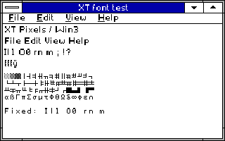
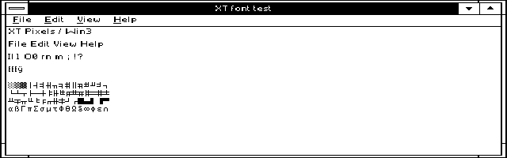
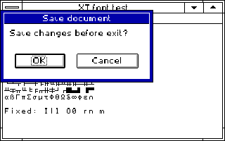
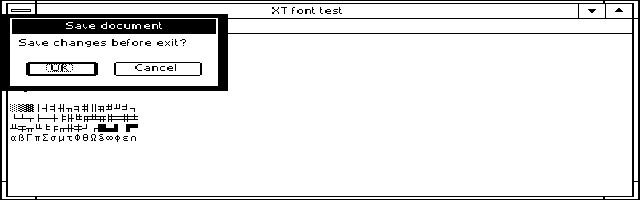

# XT Pixels R10 original fonts

Windows XT rc.5 bundles original MIT-licensed System, Fixed and OEM bitmap
fonts for CGA/EGA, plus a fixed TXTSYS strike. The six inspected Windows
dependencies are CGASYS, CGAFIX, CGAOEM, EGASYS, EGAFIX and EGAOEM. New
8.3 XTC*/XTE*/XTTSYS filenames make Windows Setup copy our fonts instead of
retaining same-name installed fonts. Resource identities, every advance and
required system/dialog metrics are preserved.

[Glyphs and generator](../../tools/XTFONTS/README.MD) explain verified resource
contracts, encoding, provenance and host reproduction. No Microsoft/ROM
glyph bitmaps were copied or rasterized. The ready fonts and source are MIT;
other suite components keep their existing licenses. No Python or Windows
font media is required on the vintage machine. Windows itself, CGA.GR2,
CGALOGO.LGO and existing non-font components remain user-supplied.

## Qualification

[Final qualification](../QUAL/FONTSR10.JSON) binds the exact R10 disk, runtime,
helper, source and fonts. Both normal and explicit /VERIFY font-free DOS
preparation, Setup, cold Win3 GDI rendering and exact rollback passed. All
113 original Windows files and both boot files matched after rollback,
including deliberately edited INIs. Normal diagnostic SHA/readback/comparison
counters were zero. /VERIFY exercised SHA, readback and comparison checks.

The complete-byte fixtures verify all 256 byte inputs for each stock font,
every advertised glyph/advance and default substitution. TXTSYS was also
verified in graphics. Five graphics modes passed stock metrics and System/
OEM pixels. Host checks reject malformed offsets/resources and reproduce
all 7 FONs exactly. CI packages those same native-tested binary bytes; it
does not rebuild native code or launch an emulator.

The qualified zero-SHA/faster START base is retained, including its Settings
and Computer-profile fixes. ZEROFAST and related records are historical base
evidence; FONTBLD/BUILD.JSON are pre-native build snapshots. FONTSR10 and the
release QUALIFY.JSON supersede their pending flags for these exact bytes.
The old wording inside the tested image is retained to keep its bytes exact;
follow current START-HERE and the user manual.

## Native captures and limits

| Final 320 alias transaction | Earlier 640 fixture, same R10 font bytes |
| --- | --- |
|  |  |
|  |  |

These are genuine unscaled Windows 3.0 Tandy emulator captures. The 640 run
predates the filename aliases, with identical font bytes. HOST renders and
atlases are separately labeled by the generator. No physical 8088 timing
qualification is claimed. The exclusive emulator lease was released.

At 160 pixels menus wrap and the 218-pixel probe dialog clips. An original-font
control reproduced identical metrics and geometry; preserving metrics cannot
make every wide Windows dialog fit. At 320/640 the probe and button labels fit.
Experimental 80x25 text still has known extended-character/adjacent-cell
corruption; it is not visually qualified. No ROM bitmap atlas was extracted.

ASCII, Latin-1 and early Windows ANSI forms are drawn. Reserved ANSI bytes
7F,80,81,8D,8E,8F,90,9D,9E use visible boxes; Euro/later ANSI/Unicode emoji
are not supplied. OEM covers the original advertised 01..FE CP437 range;
00/FF use its original blank-space default. Modern Unicode GDI maps five
reserved ANSI bytes differently; direct native byte tests passed all 256.
See HOST/MISSING.JSON and the generator's coverage report.
