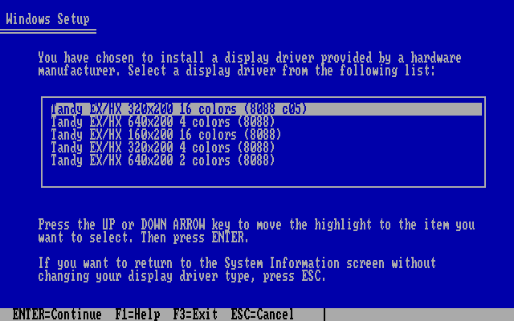
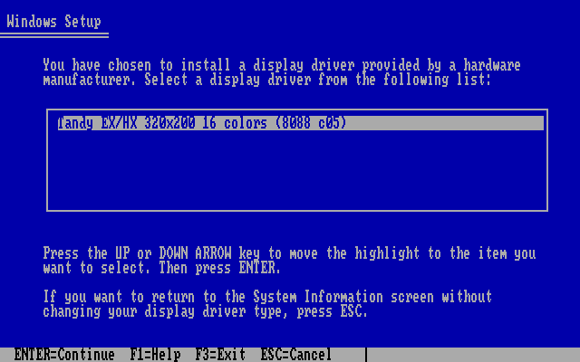
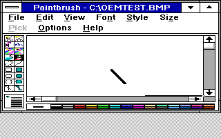
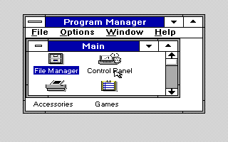
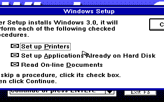
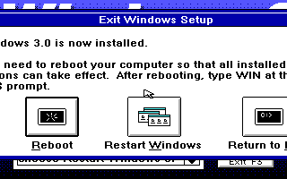

# TANDY88 ready-to-use OEM disk contract

## Normal download and developer rebuild

`TANDY88.ZIP` is the complete end-user download. Extract `DISK1` and run its
DOS `INSTALL`, then `C:\TANDY88\TANDY88 SETUP` and Windows Setup's Other display
option. Choose one of five profiles; switching modes later uses the same Setup
flow and a Windows restart. Start with stock-CGA Windows, then select OEM
640x200 four-color for a more usable desktop width. Use `C:\TANDY88\TANDY88`
for every Windows start. There is no Python or support-file staging requirement
for normal users.

`MAKEDISK.BAT` remains the Windows developer entry point, invoking the portable
standard-library Python backend. Rebuilding requires the accepted media inputs:

```cmd
MAKEDISK.BAT --windows-files MEDIA --out TANDY88.ZIP
```

`--local-out NEWDISK` additionally writes the extracted ready-to-use disk.
`--windows-dir D:\WIN30` selects a nondefault guest Windows directory; the DOS
helper remains at `C:\TANDY88`. Without media, the normal rebuild fails clearly.
The distinct `--toolkit-only` alternative produces `T88TOOLS.ZIP`, an incomplete
developer toolkit with STAGE.PY; it is never the normal end-user package.

## Exact complete payload

The complete release contains root `README.TXT` and these `DISK1/` files:

- `TANDY88.DRV`: unchanged candidate05 320x200 sixteen-color default
- `TNDY6404.DRV`, `TNDY160.DRV`, `TNDY3204.DRV`, `TNDY6402.DRV`:
  four additional drivers with distinct runtime SHA256 pins
- `RESERVE.COM`: unchanged accepted shared reservation helper
- `OEMSETUP.INF`, `INSTALL.BAT`, `TANDY88.BAT`: verified OEM and helper sources
- `EGASYS.FON`, `EGAFIX.FON`, `EGAOEM.FON`, `CGA.GR2`, `CGALOGO.LGO`:
  the original five Windows support files, unchanged and individually pinned
- `CGASYS.FON`, `CGAFIX.FON`, `CGAOEM.FON`: the only three added Windows
  dependencies, individually pinned; eight Windows support files in total
- `TNDYLOGO.RLE`: separately pinned first-party custom startup image
- `README.TXT`, `FILE_ID.DIZ`, `LOCAL.TXT`, `MANIFEST.SHA`

The `LOCAL.TXT` filename is retained as the completion marker expected by the
already-tested installer. It now describes the complete disk. No full OS,
installation disks, compiler toolchain, emulator, or unrelated media files are
included. The exact support-file hashes appear in `BUILDING.MD` and `STAGE.PY`.

The builder reads a fixed source allowlist and the eight explicitly required
media files, plus the pinned first-party custom image. It never copies a mutable
directory tree, the historical `disk1/`, or the old root TNDY16.DRV. SZDD mode-A
expansion is local and bounded to 1 MiB per file; expanded inputs are supported
too. All 15 runtime/support/image hashes are checked. Missing,
stale, unaccepted or ambiguous files fail before an output is created. FON NE
resource bounds are validated as an additional structural check.

Archive names/order, 1980-01-01 timestamps, DOS attributes and ZIP_STORED are
fixed. Identical source/support bytes produce identical archives. The complete
extracted disk is checked against a 360 KB FAT12 budget: 720 sectors of 512
bytes; one reserved sector; two two-sector FATs; 112 root directory entries
occupying seven sectors; and 1,024-byte allocation units for the 354 data clusters.
The calculation uses extracted DOS allocation, not just ZIP byte size.

The final rebuilt package measurement is **22 files**, **320,512 bytes** of rounded file
allocation plus **6,144 bytes** overhead: **326,656 / 368,640 bytes used**, leaving
**41,984 bytes** free. [The recorded package test](modes/PACKAGE.JSON) includes the
final packaged-text rebuild and byte-identical repeated packaging.

`python3 MAKEDISK.PY --verify TANDY88.ZIP` verifies the checked-in complete
archive without separately supplied media. It checks the exact member set,
binary pins, completion marker, manifest, canonical archive metadata, current
source payload and disk-capacity budget. The release workflow can publish that
same verified archive.

## Safe installation and startup

The user must exit Windows and boot to a DOS prompt. The disk helper checks for
`LOCAL.TXT`, its source files, and Windows `WIN.COM`/`SETUP.EXE`; it requires a
successful call to the accepted `RESERVE.COM` before copying helper files into
`C:\TANDY88`. It never edits Windows configuration or auto-starts Setup. Existing
helper directories are preserved. Installation refuses unsupported memory
layouts through the existing reservation helper.

The installed `TANDY88.BAT` uses absolute helper/Windows paths. It explicitly
checks helper existence, invokes `RESERVE.COM`, and branches on `ERRORLEVEL 1`
before either `WIN.COM /R` or `SETUP.EXE`. Missing helpers and failed reservation
must not run either program. The `SETUP` or `setup` argument selects the normal
Windows Setup flow. The helper lives outside Windows and keeps working after
the OEM disk is removed. A launcher cannot prevent someone manually bypassing
it with a direct `WIN` command; the instructions require using it on every boot.

Setup owns installation of the selected display/font/support files and the INI
changes. The default TANDY88 choice uses the EGA fonts with resource/Setup tuple
`133,96,72`; all four new choices use eight-pixel CGA fonts and `200,96,48`. All
five records retain the same custom splash and stock loader. The DOS installer
copies only the two shared helpers; it does not install all five drivers into
Windows itself. See [MODES.MD](MODES.MD) for the profile table.

The unchanged RESERVE helper conservatively protects the extra 16 KB video
overlap in every mode, including the modes with 16 KB hardware buffers. The
launcher and supported normal-640-KB memory checks are unchanged.
The DOS helper is deliberately separate: optional OEM sections are not a way
to install COM/BAT files in Windows 3.0. The setup launcher reserves memory too,
before any possible graphical phase. No manual INI edit is part of the flow.

## Validation boundaries

Host tests exercise packaging, media decoding/validation, output preservation
and manifest guards using synthetic support-file fixtures with explicit test-only
pins. Complete-release verification uses the unchanged accepted support hashes. DOS tests exercise
actual COMMAND.COM batch control flow in a disposable DOSBox-X guest with the
pinned reservation helper and sentinel WIN.COM/SETUP.EXE programs. Success and
failure of these sentinels are not evidence of a real Windows boot. The actual
OEM Setup and GUI acceptance evidence is recorded separately after testing the
complete disk with the exact accepted Windows support files.

This work preserves the default candidate05 driver and reservation bytes while
adding four separate display drivers. It does not claim Windows 3.1, protected mode, arbitrary Tandy configurations, PCjr, physical
hardware compatibility, or cycle-accurate 8088 execution.

## Five-mode package and native acceptance (2026-10-02)

- **71 host package tests** passed, including the five-profile contract and all
  eight Windows support-file pins
- **26 real DOS checks** passed; [DOS.JSON](modes/DOS.JSON) explicitly identifies
  its WIN/SETUP programs as sentinels, not actual Windows GUI acceptance
- Repeated complete archives, original compressed versus expanded support
  media, and standalone toolkit staging produced byte-identical disk payloads
- Missing or modified CGA fonts failed before output creation; exact members,
  hashes, manifest and floppy allocation were checked
- All five driver rebuilds were byte-identical, with 27 linked objects audited
  for each; the default, reservation helper and custom splash remain unchanged
- The four new profiles passed 374 Windows GDI cases / 33,024,000 pixels before
  this native installer sequence; [MODES.MD](MODES.MD#verification) keeps the
  separate rendering and installation evidence distinct



Native Windows Setup has selected all five profiles sequentially, then returned
from the default to 640x200 four-color. Five independent clones of those
Setup-produced installations passed **466 GDI cases / 38,912,000 pixels**
without SYSTEM.INI edits. Exact selected drivers and matching fonts were
checked, original CONFIG.SYS remained unchanged, and the custom splash is
embedded. On the first 640x200 four-color install, only the selected new driver
was installed; the DOS helper did not copy every profile into Windows.
[Native selection/installed-runtime record](modes/oem/RESULT.JSON).

**Final native emulator acceptance passed:** a fresh process started Windows
with only the installed C: drive, reopened the saved bitmap in Paintbrush and
returned cleanly to Program Manager. [Evidence](modes/oem/COLD.JSON).
The rebuilt ZIP passed verification and was byte-identical on repeat packaging.

Native 640x200 four-color Paintbrush Save As has already produced a 320x64,
4-bpp BMP with all four colors and all 20,480 pixels exact; its installed
C-only restart and native reopen also passed. [PAINT.JSON](modes/PAINT.JSON).
The current native Solitaire capture shows all seven columns with red/black
suits distinct and a green table; it is a launch/layout/color smoke test, not
proof of whole-game playability. [Capture](modes/6404rg/SOLITAIR.PNG).

The Windows host `.BAT` wrapper remains statically reviewed rather than natively
executed. The portable backend and real DOS helper behavior were executed.
Physical EX/HX hardware, genuine MS-DOS variants and cycle-exact timing remain
unverified.

## Historical installer evidence

The following sections preserve the source history of the original single-mode
OEM disk and custom-splash integration. Their counts, sizes and all-six-support
wording describe those checkpoints, not the current five-mode payload above.

## Original installer packaging regression evidence (2026-10-02)

The following records the stock-splash installer accepted in PR #61. The
custom-splash disk replaces the stock RLE with a separately pinned first-party
image; its repeated package and runtime acceptance is in [SPLASH.MD](SPLASH.MD).

- 47 host unit tests passed with Python 3 on the Linux cloud host
- 22 real DOS batch-control-flow checks passed in separate DOSBox-X guests,
  using the accepted reservation binary and 8086_prefetch CPU setting
- Both accepted binary hashes remained unchanged
- Complete release archives reproduced byte-identically; all six accepted
  support files, both runtime binaries, and both DOS helper scripts matched
  the GUI-tested disk byte for byte
- Complete ZIP verification passed without separate media and checked every
  archive member against its pin, manifest and current source
- Final DISK1 contains 15 files: 96,256 bytes of 1 KB-cluster file allocation
  plus 6,144 bytes FAT/root/reserved overhead = 102,400 of 368,640 bytes;
  266,240 data bytes remain free on standard 360 KB FAT12 media
- Original SZDD media expansion of the three EGA fonts matched the already
  expanded local font copies byte for byte

The Windows `.BAT` wrapper was statically reviewed; a native Windows host was
not available for this test run. Portable Python behavior and DOS helper batch
behavior were executed. The DOS sentinels establish gating, argument/path
handling and failure behavior only, not actual Windows Setup/GUI correctness.

## Post-OEM-install cold-start and runtime regressions (2026-10-02)

An already OEM-installed guest, after the separately observed GUI installation
and clean exit, was copied into three independent disposable guests. Each was
started from a fresh DOSBox-X process, with no SYSTEM.INI edits and no changes
to the accepted driver, reservation helper, installed WIN.COM or EGA fonts.
Existing PROBE.EXE, ROUND4.EXE and ROUND5.EXE test executables were copied into
those test guests only. A test batch required successful reservation through
`C:\TANDY88\RESERVE.COM` before `WIN /R <probe>.EXE`.

- CPU configuration readback: `core=normal`, `cputype=8086_prefetch`; 8086
  semantics probes matched the existing baseline
- Normal 640 KB physical configuration, expanded base memory disabled,
  XMS/EMS/UMB disabled; DOS reported 624 KB conventional, 592 KB free before
  reservation, and 574 KB free after reservation
- Cold-start probe completed: 320x200, BITSPIXEL=1, PLANES=4, NUMCOLORS=16,
  BIOS video mode 09
- ROUND4 passed all 56 crop/clip/band/compression cases, comparing 1,835,008
  framebuffer bytes with zero mismatches and unchanged caller inputs
- ROUND5 passed 8 warmups plus 64 calls with zero call failures, identical
  before/after framebuffer, and unchanged largest/free Windows heap values
  of 318,208 / 328,768 bytes after every measured 16-call block
- Before/after hashes confirm the source guest stayed untouched and each
  disposable test retained the installed SYSTEM.INI, driver, helper, WIN.COM
  and EGA fonts exactly

The existing `ROUNDGO.PY`, `ROUND4CK.PY --source-origin bottom`, and `ROUND5CK.PY`
harnesses/oracles performed these checks. Each headless process was stopped
after its probe flushed `COMPLETE=1`; this is not an additional GUI clean-exit
or interactive usability test. Actual GUI installation/draw/save/reopen/exit
and fresh initial Windows Setup are separate acceptance checks.

## Actual Windows Setup and GUI acceptance (2026-10-02)

Machine-readable summary: [oem/VERIFIED.JSON](oem/VERIFIED.JSON).

Two separate disposable guests used the completed own-media OEM disk, normal
640 KB, core=normal, cputype=8086_prefetch, no XMS/EMS/UMB, and RESERVE gating.
The original verified guest, baseline and artwork were not modified; all files
in the saved stock-CGA baseline checksum list still matched after these tests.

### Existing Windows installation: supported normal path

Starting from a clean stock-CGA Windows 3.0 guest, INSTALL reserved the exposed
16 KB video overlap and installed the DOS launcher outside Windows. Running
TANDY88 SETUP, selecting Display / Other, and supplying the complete OEM disk
installed the exact candidate05 driver and all six support files. Setup rebuilt
WIN.COM and wrote the display/font entries in SYSTEM.INI; no manual INI edits,
copying files directly into Windows, or missing-font fallback was used.

The installed driver booted through the safe launcher. Paintbrush accepted a
real mouse-drawn stroke, saved C:\OEMTEST.BMP, and reopened it visibly intact.
The file is 320x170 with 190 black pixels on a white canvas. Paintbrush closed,
and Windows exited cleanly to DOS. Independent cold-start and comprehensive
DIB checks are recorded above and in [oem/RUNTIME.JSON](oem/RUNTIME.JSON).





### Blank-disk initial Windows installation

A genuinely empty guest disk was also tested. Before starting the original
Windows SETUP.EXE, a test batch called RESERVE from the completed OEM disk and
refused to continue on a nonzero exit. Setup's Other display path selected
TANDY88, installed all dependencies, and continued into graphical Setup.
Original Windows media supplied the base OS files; the complete OEM disk
supplied its own listed support files. No INI edits were made.

Graphical Setup completed, reported that Windows 3.0 was installed, and returned
to DOS. INSTALL was then run from the OEM disk to install the permanent launcher.
The accepted driver SHA256 and EGA boot-font entries were verified in the new
installation. A new emulator process then cold-booted that fresh installation
through C:\TANDY88\TANDY88, with the OEM disk no longer mounted. Program Manager
opened with readable text and correctly placed fresh-install groups.



**Remaining usability limit:** Setup's original graphical dialogs and branding
were designed for a wider screen. At 320x200, text glyphs are readable but some
lines, buttons and dialog edges are offscreen. Keyboard navigation completed
the install. This is not a claim that every Setup label fits on the display.
The recommended stock-CGA-first, then OEM driver-change route avoids the cramped
initial graphical phase. Do not infer that an arbitrary first-install flow is
safe unless RESERVE has succeeded before graphical Setup starts.





### Historical failure reproduction, without guessing the cause

The old files were tested before repair in disposable copies:

- The checked-in TNDY16.ZIP has an older INF whose disk definition puts the disk
  label into the path field; selecting it displays a malformed disk prompt.
  It later requests FONTS.FON because its font declarations are not the required
  Windows 3.0 sections. It cannot complete as distributed.
- The newer pre-repair source INF parses with readable DOS Setup text, but
  requests EGASYS.FON from the Tandy OEM disk. It does not automatically request
  an original Windows disk as its comment claimed. Supplying the licensed media
  manually permits copying, after which Setup fails with Error Building WIN.COM
  because the OEM display record lacks its logo code/data dependencies.
- The old MAKEDISK.BAT packages the 5,464-byte root TNDY16.DRV, not the accepted
  51,296-byte TANDY88.DRV. The new builder rejects this stale/wrong-driver path.

Generalized historical glyph corruption was **not reproduced** in those DOS
maintenance runs. Its exact historical root cause remains unproven; no claim
is made that changing INF syntax alone explains it. What is established is that
the repaired complete disk performs Setup-managed installation and renders
readable glyphs through both tested Setup paths, within the clipping limit.

### Custom startup splash

All five current display records retain the unchanged `CGALOGO.LGO` loader and use
first-party `TNDYLOGO.RLE` image data. The unique filename prevents Windows Setup
from reusing an already-installed stock `CGALOGO.RLE`. Setup builds `WIN.COM`
from those inputs normally; neither the DOS helper nor a binary-patching step
modifies the installed executable. See [SPLASH.MD](SPLASH.MD) for the new disk
and actual startup evidence. The historical stock-splash tests above remain
documented as their own checkpoint.
