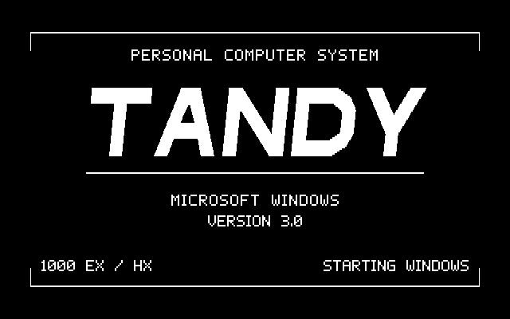
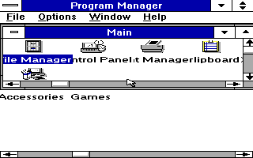

# Custom Tandy startup splash in the ready-to-use disk

The normal `TANDY88.ZIP` now includes the tested custom `TNDYLOGO.RLE` image.
Extract `DISK1`, run DOS `INSTALL`, and use Windows Setup's Other display option
as described in [README.TXT](../README.TXT). Existing TANDY88 users keep their
installed DOS helper and rerun the Setup step with the new disk. No Python,
manual INI edit, installed-image replacement, or WIN.COM patch is required.

This unedited DOSBox-X native capture is 640×400: each logical 640×200 row is
stored twice. Every captured pixel matches the authored image's doubled rows.
It is actual startup evidence, not the aspect-correct artwork preview.

## Why the filename is different

Windows 3.0 Setup reused the installed stock `CGALOGO.RLE` when an experimental
OEM disk supplied a different image under the same name. The final metadata
therefore keeps stock `CGALOGO.LGO` as logo code and names `TNDYLOGO.RLE` as data.
Setup copies that new file and builds `WIN.COM` normally. Its original first
4,336 bytes, including the complete 880-byte stock loader, stay unchanged.

The first-party image replaces the unused stock RLE in the disk's allowlist.
The five remaining Microsoft dependencies are unchanged: `EGASYS.FON`,
`EGAFIX.FON`, `EGAOEM.FON`, `CGA.GR2`, and `CGALOGO.LGO`. The accepted
candidate05 driver and RESERVE binary also remain byte-identical.

A future revised image should use a new unique 8.3 filename or a fresh test
installation; a same-name reinstall can reuse a cached file. Merely copying
an image into `WINDOWS\SYSTEM` does not update `WIN.COM`.

## Final disk acceptance, October 2, 2026

The tested disk was built by the normal package builder from current source,
the accepted first-party image, and the five pinned Windows support files.
A second independent build produced a byte-identical ZIP. A fresh copy of the
stock-CGA Windows 3.0 baseline was used for the following native test:

1. Mount the complete extracted disk and run its `INSTALL` from DOS
2. Run `C:\TANDY88\TANDY88 SETUP`, select Display / Other, and supply that disk
3. Complete Windows Setup without manual INI edits or direct WIN.COM changes
4. Compare every installed driver, font, grabber, loader, custom image and DOS
   helper byte-for-byte against the final archive
5. Exit the emulator and start a new process with only the installed C drive,
   so neither the OEM disk nor the Windows source-media directory is available
6. Start through `C:\TANDY88\TANDY88`, observe the custom splash and the
   accepted 320×200 sixteen-color desktop, then exit Windows normally to DOS

The cold-start batch paused before launching so native capture could be enabled;
no Windows file or startup code was changed to extend the splash. Clean exit
was observed directly at the DOS prompt after Program Manager's confirmation
dialog. Program Manager was maximized for the desktop capture.

The emulator configuration was `machine=tandy`, `core=normal`,
`cputype=8086_prefetch`, `memsize=0`, `memsizekb=640`, expanded base memory off,
XMS/EMS/UMB off, `fpu=false`, and `cycles=20000`. RESERVE ran before `WIN /R`.
No CPU or memory downgrade was used. DOSBox-X calls its 8088-compatible
four-byte prefetch core `8086_prefetch`; the cycle setting is not a physical
Tandy performance measurement.

## Package and source verification

- 61 host packaging tests passed, including independent toolkit staging,
  exact archive membership, reproducibility, wrong/missing custom image,
  five-file Microsoft media fixtures, and the unique-name OEM contract
- 22 actual DOS helper control-flow checks passed in disposable guests
- Splash source tests pass pixel/PBM round trips, malformed input rejection,
  and oversized encoder/decoder input rejection
- The package verifier checks the custom image's exact SHA-256 and also parses
  its legacy BMP/RLE structure, palette, run bounds, row count and terminator
- The complete ZIP passes current-source verification without separate media
- DISK1 contains 15 files, using 96,256 bytes of 1 KB-cluster file allocation
  plus 6,144 bytes of FAT/root/reserved overhead: 102,400 of 368,640 bytes

[Machine-readable result](splash/RESULT.JSON), [host output](splash/HOST.TXT),
and [DOS control-flow output](splash/DOS.JSON) distinguish native Windows
observations from synthetic sentinel tests. The existing broader driver/DIB
acceptance remains in [OEMDISK.MD](OEMDISK.MD); it was not reclassified as a
new splash-specific raster test.

The image's source, embedded bitmap alphabet, vector export and encoder are
in [src/splash](../src/splash/README.MD). Only two colors are used during startup;
the desktop remains the existing candidate05 mode. This change adds no new
selectable desktop mode. Physical EX/HX hardware, genuine MS-DOS variants, and
cycle-exact 8088 timing remain unverified.
