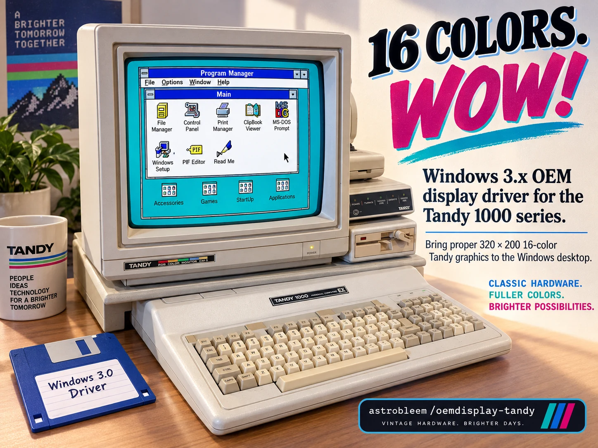
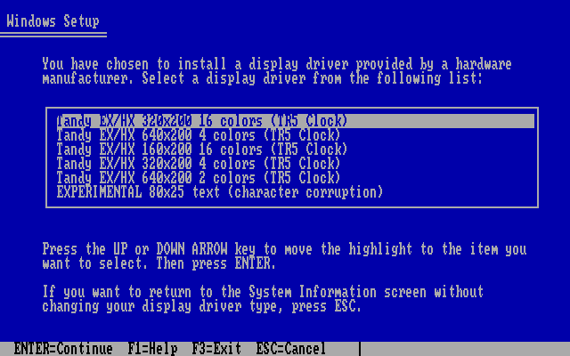
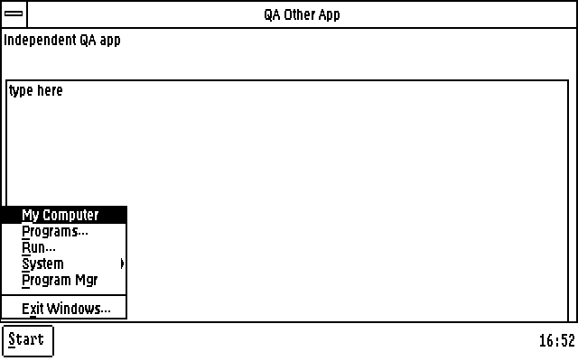
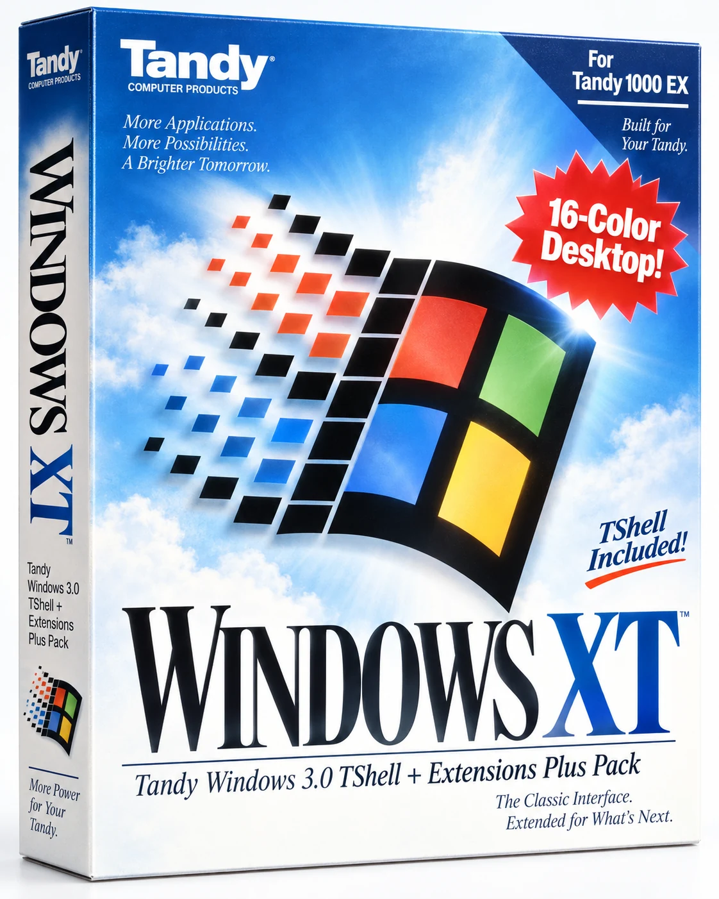

# Windows XT user manual

[Project showcase and downloads](../README.md)

**A colorful little Windows desktop for an 8088 Tandy.**

Windows XT brings five graphics modes, a compact Start-menu shell, games and
utilities to **Windows 3.0 real mode on the original Tandy 1000 EX/HX with
640 KB RAM**. This repository, OEMDisplay-Tandy, contains the display drivers,
desktop additions and their source and test evidence.

[Get started](#get-started) · [Display modes](#display-modes) ·
[The desktop](#tandy-start--tshell) · [Apps](#games-and-utilities) ·
[Performance](#performance-and-verification) ·
[Sound companion](https://github.com/astrobleem/oemsound-tandy)



*Project artwork, not a hardware photograph or official Tandy/Microsoft
packaging. The monitor uses an [actual emulator capture](tandy-dib-roundtrip.png).
[Artwork details](PROMO/README.MD).*

The accepted independent startup default is a [slow flag wave](../examples/WXTSPL/WAVE/README.MD)
with steady colors and lettering, exact native-qualified bytes and key skip.
The portable toolkit includes the own-media preparation tool. The guarded 720 KB DOS installer enables it in Color mode; other profiles
retain static startup. The qualified faster helper and zero-SHA default
installation are included in rc.6. See the wave kit for rollback
and the baseline-equivalent EXJOY polling limitation.


*Actual accepted emulator capture: steady colors and lettering, with a short
flag wave before loading. Available through the independent Color starter;
the final DOS installer path is qualified; normal startup skips SHA work. [Capture provenance](PROMO/XTWAVE.JSON).*

The startup picture is **Windows XT** in every current display profile.
The retired Tandy picture is not an installation option. Historical OEM
artifacts remain intact for provenance and recovery. For an older installation,
the [splash-only updater](../examples/WXTSPL/README.TXT) preserves the existing
loader prefix and original backup; applying it is an explicit DOS command.

## At a glance

- **Five graphics modes:** 160 or 320 pixels wide in sixteen colors,
  320 pixels in four colors, or a 640-pixel desktop in two or four colors.
- **Tandy Start desktop:** Programs, My Computer, Run/Browse, a clock, screen
  savers, optional sounds and guarded Hold-to-Start support.
- **[Long filename browsing](#long-filename-browsing):** show existing VFAT labels
  on supported fixed FAT12/FAT16 volumes under DOS 6.22; navigation and launch
  use DOS short aliases. Labels are read-only.
- **One support folder:** `C:\WINXT`, with native Windows Setup, matching
  fonts, a guarded launcher and numbered recovery backups.
- **Small native apps:** Cookie Clicker, Fly Swat, Pinball, XTEyes, GIF
  conversion for Paintbrush and more.
- **An experimental sixth mode:** real 80×25 hardware text, with known
  character corruption. Choose a graphics mode for ordinary use.

**Status:** experimental software with emulator tests and limited reports
from a physical Tandy 1000 EX. Hardware reports do not certify every current
binary or app. See the [mode table](#display-modes) and
[detailed status](STATUS.MD).

## Get started

**Public preview: [Windows XT 0.1.0-rc.6](https://github.com/astrobleem/oemdisplay-tandy/releases/tag/v0.1.0-rc.6).**
Download [WINXT720.ZIP](https://github.com/astrobleem/oemdisplay-tandy/releases/download/v0.1.0-rc.6/WINXT720.ZIP) for the disk image
and instructions, or [WINXT720.IMG](https://github.com/astrobleem/oemdisplay-tandy/releases/download/v0.1.0-rc.6/WINXT720.IMG) directly
for GoTek/emulators. [SHA256SUMS](https://github.com/astrobleem/oemdisplay-tandy/releases/download/v0.1.0-rc.6/SHA256SUMS) verifies
the assets. This is an experimental prerelease; supply your own matching
Windows 3.0 files and back up your installation.

Newer optional builds have their own [public experimental downloads](https://github.com/astrobleem/oemdisplay-tandy/releases/tag/experiments-2026-10-07):
[TRIAL7](https://github.com/astrobleem/oemdisplay-tandy/releases/download/experiments-2026-10-07/TRIAL7.ZIP), [shell fixes](https://github.com/astrobleem/oemdisplay-tandy/releases/download/experiments-2026-10-07/TSFIX01.ZIP),
[Tandinator 0.3.8](https://github.com/astrobleem/oemdisplay-tandy/releases/download/experiments-2026-10-07/TANDI11.ZIP) and app/saver polish.
They are separate from the TR5 disk above; use each packet's instructions and
[checksums](https://github.com/astrobleem/oemdisplay-tandy/releases/download/experiments-2026-10-07/SHA256SUMS).

### Choose the right package

| What you want | Start here |
| --- | --- |
| GoTek, emulator or 720 KB floppy | [Windows XT disk image](../tools/FLASHDISK/README.MD): current TR5 drivers, optional desktop and a DOS helper that gathers your own Windows files. No Python needed to install. |
| Copy directly to CF/hard disk | [One-folder WINXT source and staging guide](../distributions/WINXT/README.MD): the same current runtime, with optional host-side staging. |
| Games and utilities to try on an existing setup | [TANDYLAB test pack](../examples/TANDYLAB/README.MD): a separate, versioned app collection. Check individual component guides for newer work. |

### 1. Mount the 720 KB disk and prepare Windows XT

Start with a **backed-up, working Windows 3.0 installation** on DOS 3.3 or
later. Download `WINXT720.IMG` (or the same image inside `WINXT720.ZIP`)
using the [disk download/build guide](../tools/FLASHDISK/README.MD). Select it in
your GoTek or mount it as a **720 KB floppy** in your emulator. Boot your
existing DOS system first: this is an installation data disk, not a boot disk.
No 1.44 MB controller support or Python is needed on the Tandy.

At a plain DOS prompt, outside Windows:

```bat
A:
CD \
INSTALL
```

The DOS helper gathers and verifies matching support files from your own
`C:\WINDOWS` and `SYSTEM` folder. If some files are missing, it lists them
and stops; supply a directory copied from your own Windows 3.0 media with
`INSTALL D:\WIN30SRC` (use your actual path). Original compressed files are
accepted. After validation and your confirmation, it prepares a new
`C:\WINXT` without changing Windows or overwriting an existing WINXT folder.

The public image includes original MIT fonts and excludes proprietary
Windows support files; the completed
own-media folder contains your private copies. **Do not redistribute it.**
For direct CF transfer or advanced host-side staging, use the
[one-folder guide](../distributions/WINXT/README.MD).

### 2. Install through Windows Setup

Exit Windows completely. At the DOS prompt:

```bat
C:
CD \WINXT
INSTALL
```

In Setup, select **Display → Other display**, enter **`C:\WINXT`**, choose
a mode and accept **Complete Changes**. If asked for the display disk again,
use the same folder. If Setup offers to alter CONFIG.SYS, choose **option 3:
make no changes**.

The new Computer choice is optional: **Tandy 1000 EX/HX (WindowsXT)**.
INSTALL adds it without selecting it or changing the active keyboard. To use
it, run `C:\WINXT\WINXT SETUP`, select Computer, then this choice, and accept
Complete Changes. Close and reopen Setup before changing another item: the
Computer screen can temporarily display VGA and an enhanced-keyboard default.
Reopening shows the saved display and keyboard; the Computer-only change
preserves those settings. Check them before starting Windows. A separately
installed, verified TNDYK3 keyboard remains selected; this disk does not add it.

For the optional Tandy Start desktop, run once from DOS:

```bat
C:\WINXT\TSSETUP
```

This fresh-install step refuses to overwrite existing shell files. For an
existing Tandy Start installation, follow the
[upgrade guide](../examples/TSHELL/README.MD) and preserve your settings.

### 3. Start Windows

At a fresh DOS prompt, use:

```bat
C:\WINXT\WINXT
```

**Always use this guarded launcher, including for lower-color modes and
Setup. Never bypass a video-memory reservation or recovery error by running
WIN directly.** It starts Windows in real mode. A verified optional-shell
installation uses Tandy Start for that graphics session and restores the
original shell on exit; experimental text keeps the original Windows shell.

### Change modes or roll back

Exit Windows and run `C:\WINXT\WINXT SETUP`. Select **Other display** and
`C:\WINXT` again, choose the new mode, then reboot and use the guarded
launcher. Use Setup rather than editing SYSTEM.INI by hand.

To restore the pre-installation configuration, use the backup path printed
by INSTALL and recorded in `C:\WINXT\BACKUP.TXT`. For example, from DOS:

```bat
C:\WINXT\BACKUP\B001\RESTORE YES
```

`B001` is an example; use your actual numbered backup. Restoration verifies
the saved files and disables automatic optional-shell dispatch. New files
may remain on disk but are no longer selected. Keep the backup until the
restored system works; resolve any restore failure before starting Windows.

[Full installation and recovery guide](../distributions/WINXT/README.TXT) ·
[Installation, six-mode switching and rollback evidence](UNIFIED/README.md)

## Display modes

All five graphics profiles have 200 logical rows. These are the driver
identities in the current public WINXT kit:

| Mode | Palette / purpose | Driver | Physical Tandy status |
| --- | --- | --- | --- |
| **320×200, 16 colors** | Full Tandy palette; default profile | `TR53216.DRV` | Paintbrush and TSHELL worked on a later trial; still slow |
| **640×200, 2 colors** | Wide black-and-white desktop | `TR56402.DRV` | Earlier TRIAL 3 reported substantially faster and usable |
| **160×200, 16 colors** | Smallest desktop; full Tandy palette | `TR51616.DRV` | Low-resolution report did not identify the exact mode |
| **320×200, 4 colors** | Black, cyan, magenta, white | `TR53204.DRV` | Operation reported; red hearts mapped to black |
| **640×200, 4 colors** | Black, red, green, white | `TR56404.DRV` | Unconfirmed; emulator hardware model remains uncertain |
| **80×25 hardware text** | BIOS mode 03h; 640×200 logical GDI surface | `TXTMODE.DRV` | Lab-only; physical behavior and speed untested |

The physical observations above concern earlier trials, with no final-file
hash readback. **They are not acceptance of the exact TR5 files in this
table.** The known-working TRIAL 3 monochrome fallback is a different binary;
keep it separately. [Hardware reports and scope](STATUS.MD).

Original EX/HX 640×200 Tandy graphics has **four colors, not sixteen**.
Narrow modes can clip stock Windows dialogs. In 320×200 four-color mode,
stock Clock's digital digits are invisible; use analog Clock or another mode.

<details>
<summary>See the six Setup choices and the text-mode caveat</summary>



Actual Windows 3.0 Setup in the emulator. The experimental text driver runs
unchanged Program Manager and Notepad in real hardware character cells, but
window movement, clipping, caret inversion and bitmap restore can corrupt
characters. It is not ready for everyday use. TSHELL is not qualified for
this driver; switching back to graphics restores the appropriate fonts and
optional-shell path.

[Text-mode experiment](../experiments/TEXTMODE/README.MD) ·
[Known failures and measurements](../experiments/TEXTMODE/EVIDENCE/RESULT.JSON) ·
[Runtime text-mode notes](../distributions/WINXT/TEXTMODE.TXT)

</details>

## Tandy Start / TSHELL

Tandy Start 14 adds a compact Start menu and clock bar while keeping
Program Manager as the editor for your program groups.

- **My Computer and Programs:** open or restore File Manager; browse existing
  Program Manager groups with paging, saved arguments and working directories.
- **Run / Browse:** launch from the program's folder, with read-only **long filename
  browsing** from validated FAT/VFAT metadata. Launches still use DOS aliases;
  unsupported metadata falls back to short names.
- **Clock and System:** right-click the clock to adjust date/time; double-click
  to open Clock or Calendar. About This Tandy shows system, display and memory
  pages. The compact controls fit the 160-pixel desktop.
- **Screen savers:** None, Matrix, Maze or Starfield; 10–3600-second idle delay,
  unsaved Preview, and Starfield speed/star-count options. Maze can be very slow.
- **Sounds and exit:** optional Tandy or XP-note startup phrase and pre-exit
  chime. Hold Shift while selecting Exit to skip the chime. Application save
  prompts remain active; successful return to DOS can show moon-and-stars art.
- **Hold-to-Start:** optional original-Tandy Hold key support through the
  compatible keyboard driver and TSINPUT helper. The default is guarded by
  the supported real-mode ROM and loaded driver profile.

| Tandy Start desktop: Hold opens Start over another app | Green hill wallpaper with Tandy Start 13 |
| --- | --- |
|  |  |

Actual emulator captures, with doubled rows and, for the hill scene, columns.
The wallpaper image retains its version 13 identity. Physical Hold behavior
and the later Browse redraw improvements remain unverified. Friendly-name
browsing and all three savers have hardware reports, with Maze slow.

Maximized apps can cover the bar; there is no application taskbar. The idle
saver is not a password lock. See the
[launch, upgrade and recovery guide](../examples/TSHELL/README.MD) and
[version 14 changes and test scope](../examples/TSHELL/TESTS14.MD).

### Long filename browsing

Start **Run > Browse** can show the long names already stored on a CF card or
hard disk, including names containing spaces. The selected **DOS short alias**
remains visible below the list; opening folders and launching apps uses that
alias. Long labels are read-only: the shell does not create or rename long
filenames, invent `~1` aliases, or add long-path support to other apps. Type
DOS-compatible short paths in Run.

The verified reader requires **DOS 6.22, Windows 3.0 real mode, and a fixed,
uncompressed local FAT12/FAT16 volume with 512-byte sectors**. This is a narrower
requirement than the DOS 3.3+ installer. FAT32, removable/floppy and network
volumes, SUBST/JOIN/ASSIGN mappings and detected DriveSpace use short names.
An emulator host-folder mount is not a qualified raw FAT volume.

Unsupported non-ASCII, invalid or ambiguous entries also use aliases. The
filtered list must have at most **128 rows**, including folders and drives;
long labels above **63 characters** show an ellipsis. Read, memory or scan-limit
failures preserve short-name browsing. Genuine DOS tests cover 16 MB and 64 MB
FAT16 volumes; physical browsing has been reported working, while later redraw
improvements retain their recorded emulator scope.

[Requirements and fallback behavior](../distributions/WINXT/NAMES11.TXT) ·
[Native verification](../examples/TSHELL/TESTS14.MD)

### Optional desktop additions

| Addition | What it provides |
| --- | --- |
| [Original keyboard support](../src/tandyk3/README.md) | Separate compatible real-mode driver candidate; [public tools/probes](https://github.com/astrobleem/oemdisplay-tandy/releases/download/experiments-2026-10-07/K3TOOLS.ZIP) exclude the driver. Guarded install and rollback. Seventeen raw key press/release pairs matched hardware; Windows translation and Hold still need physical verification. |
| [Windows XT splash updater](../examples/WXTSPL/README.TXT) | CHECK, APPLY and RESTORE for a recognized startup file, preserving display drivers, fonts and INI settings. |
| [Green hill wallpaper](../examples/HILLS/README.TXT) | Native RGBI landscapes for 160×200 and 320×200 sixteen-color modes, using about 16 KB / 32 KB of bitmap memory. Turn wallpaper off before switching to monochrome. |
| [XTEyes](../examples/XTEYES/README.TXT) | A small native GDI window whose eyes follow the pointer, with integer geometry and bounded redraws. Physical responsiveness is unmeasured. |

These standalone additions are opt-in; the main installer does not activate
them all automatically.

## Games and utilities

The newer [Maze game preview](../examples/MAZE/GAME/README.MD) is available
separately. The disk image retains the older Maze saver described below.

| App | What to try |
| --- | --- |
| [Tandinator 0.3.8](../experiments/TANDI11/README.MD) | Optional experimental character oracle with pixel art, moving eyes and a quiet demo. Notebook learning starts off; Ask Two is explicit. [Canonical v0.2](../examples/TANDINAT/README.MD) remains separate; physical testing is open. |
| [Cookie Clicker](../examples/COOKIE/README.MD) | Click or press Space, buy cookies-per-second upgrades, save and load. Fits 160×200. |
| [Fly Swat 1.1](../examples/SWAT/README.MD) | Mouse-controlled fly hunting with score, three hearts, pause and restart; fullscreen and windowed paths, plus `/G` fallback. |
| [Pinball](../examples/PINBALL/README.MD) | Two flippers, three bumpers and three balls; Space launches, Z/Left and / or Right flip, P pauses. |
| [Matrix](../examples/MATRIX/README.MD) | Fullscreen character rain, on demand or as the shell's idle companion. |
| [Maze](../examples/MAZE/SAVER10/README.MD) | Experimental raycasting saver and windowed demo. Trial aliases use clipped GDI; approximate-XT settings can be very slow. |
| [Starfield](../examples/STARFLD/README.MD) | GDI flying stars, three speeds and 16/32/64-star settings. Sixteen stars is the lightest option. |
| [Slosh](../examples/SLOSH/README.MD) | Drag the title bar and watch a tiny water surface rebound and settle. |
| [Brighter Tomorrow](../examples/BRIGHT/README.MD) | A compact choices-and-consequences game with workplace notices, receipts and two endings. |
| [GIFLOAD](../examples/GIFLOAD/README.TXT) | Convert supported static GIFs to new palette-mapped BMPs for Paintbrush. It does not add formats to Paintbrush itself. |
| [COMMDLG demo](../examples/COMMDLG/README.TXT) | Bounded app-local Open/Save dialogs for Windows 3.0; use the pack's CDSTART launcher. |
| [FileDrop demo](../examples/FILEDROP/README.TXT) | Drag one or two path names between demo apps. It transfers names, not file contents. |
| [About This Tandy](../examples/TABOUT/README.MD) | System, display and memory pages with refresh; exact hardware-model detection remains deferred. |
| [EXJOY](../examples/EXJOY/README.MD) | Raw joystick axes/buttons, range display and session-only center calibration. Physical input remains unverified. |
| [DOS WHEEL diagnostic](../tools/WHEEL/README.TXT) | Bounded mouse-wheel/API and serial diagnostics. Raw Genius data was detected; this public diagnostic does not install Windows scrolling. |

These are retained emulator captures, not physical performance measurements.
[Screenshot sources and exact scope](SHOTS/README.MD).

The [TANDYLAB catalog](../examples/TANDYLAB/CATALOG.TXT) describes the separate
test pack and paired runtime files. Stock Windows apps shown in project
captures, such as Paintbrush and File Manager, come from your own Windows
installation.

The first-run disk update adds a Windows XT group in Programs, with the three
savers, About and bundled Pinball v2. Existing Program Manager groups remain
read-only. Setup now records the actual source directory for later disk reads;
backup/next-step messages and Exit keys are clearer. See the
[first-run evidence and remaining checks](FIRSTRUN.MD).

The recovered experimental Win3 wheel extension has passed exact rebuild and
loader/rollback tests locally, but actual mouse events and physical wheel
transport remain unverified. It is not a public driver download. The public
[UTILDOS1 diagnostic/tools packet](https://github.com/astrobleem/oemdisplay-tandy/releases/download/experiments-2026-10-07/UTILDOS1.ZIP) is separate.

Newer public app packets complement the separate TANDYLAB collection:

| Packet | Contents |
| --- | --- |
| [VISPART1.ZIP](https://github.com/astrobleem/oemdisplay-tandy/releases/download/experiments-2026-10-07/VISPART1.ZIP) | Matrix low-color polish and XTEyes pupil travel. |
| [VISPART2.ZIP](https://github.com/astrobleem/oemdisplay-tandy/releases/download/experiments-2026-10-07/VISPART2.ZIP) | Maze startup slicing and Starfield overlap/Arwing repairs. |
| [UTILGUI1.ZIP](https://github.com/astrobleem/oemdisplay-tandy/releases/download/experiments-2026-10-07/UTILGUI1.ZIP) | EXJOY, FileDrop and app-local dialog polish. |
| [ARWING02.ZIP](https://github.com/astrobleem/oemdisplay-tandy/releases/download/experiments-2026-10-07/ARWING02.ZIP) | Optional Starfield flight mode and its matching shell. |

Use each packet's source, scope and installation guide; alternate shells are
not automatically combined with TSFIX01 or the baseline desktop.

### Add some Tandy sound

The companion **[OEMSound-Tandy](https://github.com/astrobleem/oemsound-tandy)**
project has Mini MIDI, Mini Piano, Beats Lab, Automatic Mouth, PSGPLAY and
startup/exit chimes. Its [public starter release](https://github.com/astrobleem/oemsound-tandy/releases/tag/sound-v0.1.0-preview.20261007)
and [experimental PIT/voice kits](https://github.com/astrobleem/oemsound-tandy/releases/tag/sound-exp-v0.1.0-pit.20261007)
are separate downloads. It uses the Tandy's three square-wave voices and noise
voice. Follow each app's guide: app-local MIDIMAP is not a system MIDI device
or General MIDI synthesizer, and only one PSG producer should run at a time.

### Buddy video companions

[Buddy Movie Maker + Player](https://github.com/astrobleem/buddy-movie-maker/releases/tag/v0.2.0-experimental)
is a separate public **Windows 10/11 x64 maker** that exports a DOS movie folder;
its preview is silent. The older [Win3 player](https://github.com/astrobleem/oemsound-tandy/blob/main/examples/BUDDY/README.TXT)
has its own format and test scope. Maker's Win16 WZG1 path is unsupported.
The new BVP work remains local and is not part of either public package.

A 16 MB versus 64 MB Browse test does not establish Buddy playback support.
Maker's maximum video alone is about 46.9 MiB, so it cannot fit on a 16 MB
volume; use the chosen player's guide and enough free space for the complete
movie folder. Do not treat disk capacity as native playback qualification.

## Performance and verification

The graphics drivers keep an 8086/8088-safe drawing path and reserve shared
video memory before Windows starts. Proven drawing cases refresh bounded
regions; uncertain bounds fall back to the original synchronous full-screen
copy. Palette conversion, compatible bitmaps and bounded BI_RGB support
include Paintbrush save/reopen checks.

**The public TR5 change targets repeated Clock-border copies.** It expands
the validated multi-interval scanline refresh gate while preserving the
original renderer, raster rules and cursor protections. Stock CLOCK.EXE is
unchanged.

| Measured operation | TRIAL 4 | TRIAL 5 |
| --- | ---: | ---: |
| Two-pixel rectangle, 121×72 client, 160×200×16 | 1,318 ms | 55 ms |

About **24× faster for that measured operation**, in exclusive paired
DOSBox-X runs at fixed 25,000 cycles. The guest timer resolves roughly
55 ms; these cycle settings are uncalibrated and **do not predict physical
8088 speed or an overall Windows speedup**.

The five-mode paired rectangle suite compared **6,560 cases** with zero
framebuffer differences against TRIAL 4. Coverage included pen widths, all
16 ROP2 values, clipping, coordinate transforms and cursor corners. This is
bounded regression evidence, not complete GDI or hardware qualification.

[TR5 design and reproduction](TRIAL5/README.MD) ·
[Exact binaries](TRIAL5/BUILDS.JSN) ·
[Timings, regression coverage and limits](TRIAL5/VERIFY.TXT)

### Optional TRIAL7 test build

The [public TRIAL7 experimental overlay](https://github.com/astrobleem/oemdisplay-tandy/releases/download/experiments-2026-10-07/TRIAL7.ZIP) publishes the
qualified border/text candidate with the retained TR6 DIB optimization,
source, emulator evidence and a one-shot saved-backup rollback kit. It needs
the exact default-layout TR5 installation and changes only its already
active mode. Restore any TR6 overlay first. Stable packages and build
defaults remain unchanged; physical 8088 timing and EX/HX 640x200 four-color
behavior still need hardware testing.

### What still needs testing

- Exact current binaries on physical EX/HX hardware, especially 640×200
  four-color behavior; the emulator's model remains uncertain.
- Text-mode character/geometry corruption and DOS-app/grabber switching.
- Physical Windows keyboard translation, Hold-to-Start and joystick input.
- Broader app compatibility, long-running use and calibrated hardware timing.

Windows 3.1, standard/enhanced mode, PCjr, other memory layouts and an
unexpanded 256 KB EX are outside the current acceptance scope. Large redraws
can still be slow. [Complete development status](STATUS.MD).

## Build, explore and contribute

- [Build guide](../BUILDING.MD): host tooling and historical package reproduction.
- [Current TR5 driver guide](TRIAL5/README.MD): source pipeline, profile
  names, audits and exact build identities.
- [Mode contracts](MODES.MD): palettes, fonts, memory and retained evidence.
- [Unified installation evidence](UNIFIED/README.md): staging, Setup,
  six-mode lifecycle checks and verified rollback.
- [Source provenance](../src/tandysw/PROVENANCE.md): third-party inputs and notices.

Preserve the historical binaries and package pins when experimenting.
A successful rebuild does not make a new driver hardware-qualified.

Hardware reports are especially useful. Include the machine and RAM, DOS
and Windows versions, display mode, driver/app version or SHA-256, exact
steps and expected versus actual behavior. Say whether the result came from
hardware or an emulator, and keep a known-working rollback available.
Preserve component licenses and third-party notices; repository inclusion
does not grant new rights to Windows, DDK material or fonts.

<details>
<summary>Windows XT concept box and project artwork</summary>

<a href="PROMO/WINXTBOX.WEBP"></a>

Promotional concept art, not official packaging or a physical product.
[Original artwork and image identities](PROMO/README.MD).

</details>

## Guarded startup and rollback

The public DOS installer enables the accepted slow wave in qualified Color
mode and retains static startup for other profiles. See the
[installer guide](../tools/FLASHDISK/README.MD) for preparation and the exact
wave-only/full rollback commands. This is a short pre-load animation.
[Native installer qualification](QUAL/WAVEINS.JSON) records normal Color and
static Windows exits, three native refusals, and 35-file rollback. Tests use
DOSBox-X Tandy/8086/640 KB; they do not establish physical 8088 speed.

## Original fonts in rc.6

The [XT Pixels fonts](FONTS/README.MD) replace all six Windows font dependencies
and the derived text strike. No font setup media or Python is needed on the
Tandy. Windows itself, CGA.GR2, WIN.CNF and other non-font components remain yours.
Normal preparation/install skips SHA verification and readback; explicit
/VERIFY is optional, expensive developer diagnostics. System advances and
dialog metrics stay compatible. Wide 160-pixel dialogs can clip as before;
experimental 80x25 text corruption remains. Reserved ANSI bytes have documented
boxes; no Euro or Unicode emoji is supplied. Graphics-mode compatibility and
complete native byte rendering were tested; physical 8088 timing and every
Windows dialog are not claimed. The [native previews](FONTS/SHOTS/README.TXT)
identify real Win3 emulator captures separately from host specimens.

## Display mode menu in rc.6

After the initial Windows Setup install, exit Windows and run
`C:\WINXT\MODES` at DOS. Select one of the five graphics modes. `U` restores
the previous selection; interrupted changes are recovered before video
reservation at the next guarded startup. Keep launching through
`C:\WINXT\WINXT`. The 160-pixel mode can clip stock dialogs; TEXT remains
an opt-in experiment with known renderer corruption. Read `MODEINFO.TXT`
for commands and recovery, and `BACKUP.TXT` for whole-install rollback.

The original static module replaces the CGALOGO.LGO setup-media requirement.
CGA.GR2, DOS/Windows, Setup, WIN.CNF and other non-font Windows components
still come from your owned installation/media. Native emulator acceptance
is recorded in docs/QUAL/RC6.JSON. PREPXT's documentation pin data was then
refreshed on the host, preserving measured code and relocations; that
refreshed helper was not rerun in a guest. Physical hardware is unqualified.
