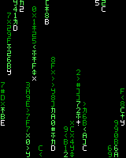

# Matrix rain for Windows 3.0 / Tandy 8088

**Launch-on-demand only.** Run `MATRIX.EXE` from Windows. Keyboard input, mouse buttons or pointer movement dismiss it. It does not automatically start after idle time, install a helper, register a Windows 3.1 `.SCR`, or provide a password lock.

This is an isolated graphics application. It changes no driver, palette, video mode, normal launcher, Windows setting or default build. Start Windows with the existing accepted TANDY88 launcher as usual. All glyphs are original simple 8x8 symbols.

## Rendering and safety

Known real-mode display/BIOS/size/color tuples use sparse writes to the B800 graphics framebuffer, with foreground, overlapping-window, mode and page checks. Input, deactivation and overlap stop writes. Exit balances cursor hiding and flushes the driver's current canonical shadow before destroying the window. The slower GDI fallback can be selected with `/G`.

Repaint recovery samples 16 occupied cells; it is not exhaustive protection against arbitrary background video writers. The application source does not perform direct I/O-port or BIOS-mode operations. The scoped binary audit includes reached compiler runtime code and does not certify imported Windows routines or unresolved indirect continuations.

## Evidence and limits

- All five accepted display profiles matched the host framebuffer oracle byte-for-byte over their visible regions.
- 55 message-driven control/restoration checks passed, including background flush repair and a nonactivating popup. These are automated Windows-message tests, not physical keyboard/mouse or manual Program Manager tests.
- Forced GDI fallback completed its 60-update 160x200 check. Warm free memory was stable in the bounded runs; this is not a long-duration leak proof.
- Two warning-free builds produced the identical 11,213-byte executable. Host AddressSanitizer/UndefinedBehaviorSanitizer tests and a scoped 8088 instruction audit passed.
- On the uncalibrated DOSBox-X approximate-XT preset, the final executable completed about **5.60 updates/sec at 160x200x16** and **2.26 updates/sec at 640x200x4**. These are animation updates, not refresh rates or physical Tandy measurements. Other modes were checked at accelerated settings.
- Physical hardware, manual input/cursor observation, protected-mode fallback, arbitrary third-party drivers/applications, low-memory stress and long-duration use remain unverified.

Read [run/build instructions](README.TXT), [measured results and limitations](RESULTS.TXT), [native results](EVIDENCE/RESULT.JSN) and [publication verification](EVIDENCE/PUBCHECK.JSN). The [source](SOURCE) includes build, emulator-lab, framebuffer decoding and test tools. Use `python3 SOURCE/BUILD.PY --repo <owned-project-toolchain> --dosbox <dosbox-x> --out <new-build>` from this directory; an explicit `--repo` is needed for this nested publication layout.

## Package and provenance

[MILESTONE.ZIP](MILESTONE.ZIP) is the complete, byte-identical standalone package (78,129 bytes). Every original member, including source, executable, screenshots, raw framebuffer captures and recorded test evidence, is preserved. `MANIFEST.JSN` hashes those original members; it excludes itself and the added publication README, publication check and ZIP. Original evidence line endings are preserved; the added publication documents use CRLF.

The privacy scan found no absolute host build paths or private environment identifiers in the sealed package. No path substitutions were necessary. Generic DOS guest/toolchain paths are retained so the logs remain meaningful. No Windows, SDK/DDK, compiler or ROM binaries, credentials, or private conversation data are included.

Standalone ZIP SHA256: `0f79d536e6fbce5737e2902f2bbe30295637ed4dcc2c6f0843a579bc2a76073c`.

MATRIX.EXE SHA256: `70ee3dbdb3721844c1eeadcdcecb200ac9f4b8bf2602c70a9c67712b6609cf77`.

Local checks are separate from GitHub CI. The repository's existing workflow is tag-triggered release packaging; no pull-request CI is configured. No CI run is not a passing CI result. This publication does not merge, tag or release the application.
