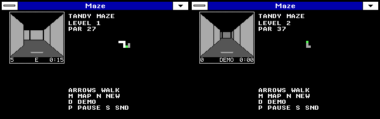

# Tandy Maze

A first-person maze game for Windows XT (Windows 3.0 real mode on a Tandy
1000 with the WINXT drivers). One key press moves one square or turns 90
degrees, as in Bard's Tale. Every level is a new random maze with the exit
in the outer wall; mazes grow from 4x4 to 15x15 cells. The same executable
is the TSHELL Maze screen saver.



## Play

| Key | Action |
| --- | --- |
| Up / Down | Step forward / back |
| Left / Right | Turn 90 degrees |
| D | Demo: the computer walks (any key takes over) |
| M | Map on or off |
| N | New maze, same level |
| P | Pause (losing focus also pauses) |
| S | Sound on or off (Tandy sound chip only) |
| Enter | Next level, after the exit |

The status line under the view shows moves, facing and time. The map
fills in as you look around: white for squares you stood on, gray (or a
checker) for squares you have seen, the exit and you in the accent colour.
Chalk marks on the floor show where you have been. Par is the shortest
walk to the exit; match it for PERFECT.

Sound uses the Tandy PSG with the same guards as Pinball and the startup
chime: real mode only, Tandy ROM signature present, and only while Maze
holds the Windows sound device. It is silent otherwise and mutes on pause,
focus loss and exit.

All five Windows XT modes work. The 160-pixel mode has no room for the
side panel, so the map is hidden and the key help sits under the view.

## Screen saver

`MAZE.EXE /S` is the TSHELL saver: the same view walking itself with the
right hand on the wall, a new maze at each exit. The lifecycle is carried
over unchanged from the previous saver (wake input draining, ownership,
focus and capture checks, no global hook, no password lock). The old raw
B800 drawing path is gone; the saver now draws like any other window.
Diagnostics for disposable test sessions: `/A` lifecycle self-test, `/I`
input observation, `/B` saver benchmark; `/T` benchmarks the game and
`/G` / `/F` force the GDI fallback. They write MAZE.LOG beside the EXE.

## Speed

On these drivers every GDI call costs about 8 ms on an 8088 and every
screen pixel about 40 us in 16 colours (5 us in mono). Maze composes each
view in a byte buffer in the driver's own bitmap format (inline assembly
for the fills), puts it in a memory bitmap with SetBitmapBits and draws it
with one BitBlt; the status line uses a built-in 5x7 font in the same
buffer. View sizes follow a per-mode pixel budget. Keys that arrive while a
frame is drawing are applied first; only the latest position is drawn.

At 360 DOSBox-X cycles (about a 7.16 MHz 8088; not calibrated hardware
timing), one step takes about 0.35 s in the 640 modes and 0.6 s in the
16-colour modes ([details](EVIDENCE/XTBENCH.TXT)). The previous Maze saver
managed 0.05-0.14 full sweeps per second on the same drivers.
[XTSPEED.MP4](EVIDENCE/XTSPEED.MP4) shows real-time play at that speed.

If a driver's bitmap format is not the Tandy 4-plane layout, Maze draws
with plain FillRect instead: correct, about four times slower, and in
2-colour modes without the dithered shading (walls white, floor black).

## Build and test

From this folder, with the repository's licensed period tools:

```
python3 BUILD.PY --dosbox <dosbox-x> --out <new-folder>
python3 BUILD.PY --dosbox <dosbox-x> --out <new-folder> --main TEST.C
python3 TEST.PY --sanitize
```

The first builds MAZE.EXE (Microsoft C 6, `/G0 /Gw /Gs /AS /W3 /Oit`,
LINK4); the second builds the same regression as a Windows app that
writes C:\MAZETEST.LOG; the third runs it on the host. The replay
checksum must match between host and 8088. FONTGEN.PY regenerates FONT.H.

| File | Contents |
| --- | --- |
| MAZE.C | Window, input, layout, map, status line |
| GAME.H | Maze generation, movement, par, autopilot |
| VIEW.H | First-person renderer into the bitmap buffer |
| SOUND.H | Tandy PSG effects |
| SAVER.H | `/S` saver lifecycle and diagnostics |
| TEST.C | Rules and renderer regression (host and native) |

[TESTS.MD](TESTS.MD) records what was tested and what was not. The
older raycasting proof and the SAVER10 saver in the parent folder are
kept unchanged as history.
