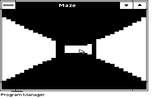

# Tandy Maze: retained windowed proof

The current optional TSHELL-compatible saver is documented in
[SAVER10/README.MD](SAVER10/README.MD). It retains ordinary windowed operation
and adds safe GDI fallback for trial drivers, but remains very slow. The
source, executable, package and evidence below are the unchanged older proof.

**The older screensaver performance gate failed.** This is a windowed raycasting proof only. It does not install an idle helper or replace a driver.

Five native display-profile checks reached about 6 frames/second in accelerated emulation with stable free memory after warm-up. These are bounded emulator observations. At the uncalibrated approximate-XT 240-cycle preset, the first paint took 87.441 seconds and a separate single-frame diagnostic took 6.316 seconds. That diagnostic is not an average steady-state frame rate. Physical Tandy timing and broad manual UI testing remain unverified.

Read [README.TXT](README.TXT) for build, run, evidence and limitations. Use `SOURCE/BUILD.PY --repo <repository> --dosbox <dosbox-x> --out <new-build>` from this published layout. The unchanged source can also be placed directly under `examples/MAZE` in a disposable build copy.

- [Recorded results](EVIDENCE/RESULT.JSON)
- [Native five-mode measurements](EVIDENCE/NATIVE.JSON)
- [Approximate-XT measurements](EVIDENCE/XT-PRESET.JSON)
- [Sealed standalone package](PROOF.ZIP)

## Publication and provenance

The source, first-party binaries, evidence and SHA256.JSON are byte-identical to the sealed standalone package. PROOF.ZIP is that complete unchanged package. SHA256.JSON describes its original members; it does not cover this added README or the archive itself.

Historical documents under SOURCE and build-only status fields are retained as provenance, not current acceptance claims. README.TXT and EVIDENCE/RESULT.JSON describe this experimental milestone.

No Windows applications, installation media, fonts, BIOS ROM, SDK/DDK/compiler binaries, credentials, or private Library metadata are added. Local source and artifact integrity checks are separate from GitHub CI. No merge, tag, or release is part of this publication.

Standalone archive SHA256: `52d61696e788a68d8a9dced5c79f5c646f840941cf4bef6f95ae79591ca6cee0`.

