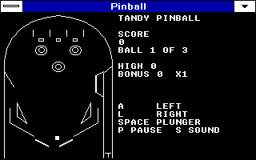
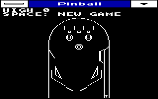
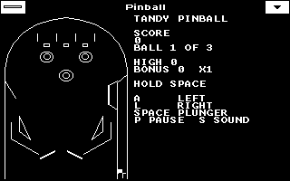
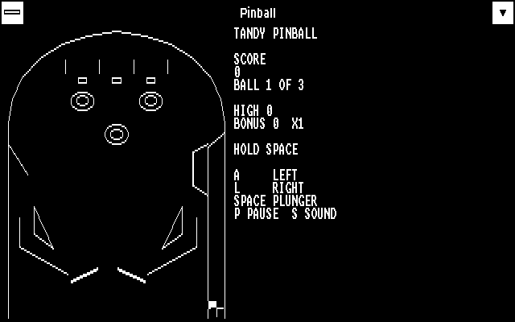

# Tandy Pinball

A wireframe pinball table for Windows 3.0 real mode on an 8088 Tandy 1000.
It runs in every Windows XT display mode and keeps the table the right
shape on a 4:3 monitor.

## Play

The first-run Windows XT disk bundles this build: choose Start > Programs >
Windows XT > Pinball. Separately copied builds can use Start > Run or
Program Manager File > Run with the full path to `PINBALL.EXE`.

| Key | Does |
| --- | --- |
| **A** | Left flipper |
| **L** | Right flipper |
| **Space** | Hold to pull the plunger, release to shoot. Also starts a game. |
| **P** | Pause / resume (losing focus pauses too) |
| **S** | Sound on / off |

Three balls per game. How hard you hold Space decides how far the ball
goes: a full pull sends it around the top arc, a tap drops it back on the
plunger to try again.

## The table

- **Flippers** swing with real angular speed. A ball hit near the tip goes
  much faster than one hit near the pivot, so you can aim. Hold a flipper
  up to **cradle** the ball, let go, and flip when it rolls to the sweet
  spot.
- **Plunger lane** with a one-way gate at the top.
- **Three top lanes.** Roll through to light them; light all three to raise
  the bonus multiplier (up to X5). The flipper buttons move the lit lanes
  left and right, like a real machine.
- **Three pop bumpers** and two **slingshots**.
- **Drop target bank** on the right. Knock all three down for 5,000 and
  extra bonus; the bank resets itself.
- **Inlanes and outlanes.** Balls that slip down the outside are gone.
- **Ball save** for about 8 seconds after each ball's first plunge.
- **End-of-ball bonus** = bonus count x 1,000 x multiplier.

| Switch | Points |
| --- | --- |
| Pop bumper | 100 |
| Slingshot | 10 |
| Top lane (unlit / lit) | 500 / 100 |
| All three lanes | 5,000 + multiplier |
| Drop target | 500 |
| Full drop bank | 5,000 |

## Sound

On a Tandy 1000 it plays short effects on the three-voice PSG: bumpers,
slings, targets, lanes, flipper clicks and a falling tone on drain. It only
touches the PSG in real mode, when the Tandy ROM signature is present, and
while it holds the Windows sound device, the same rules the chime apps
follow. It mutes every channel when paused, closed or switched away from.
On other hardware it is silent.

## Display modes

The table is drawn in table units and scaled to the window. Wide modes put
the score panel beside the table; 160x200 puts it on top.

| 160x200x16 | 320x200x4 | 640x200x4 |
| --- | --- | --- |
|  |  |  |

The static table is cached in a bitmap. The ball, flippers and plunger are
drawn with XOR, so moving them never repaints the table. If the bitmap
can't be allocated, the table is drawn directly instead.

## Build

Uses the repository's Microsoft C 6 and Windows 3.0 SDK toolchain inside
DOSBox-X:

    python3 BUILD.PY --dosbox /path/to/dosbox-x --out /new/build/dir

Flags are `/G0 /Gw /AS /W3 /Od` with LINK4 and the small-model Win16
runtime. Two builds from the same source are byte-identical.

## Test

    python3 TEST.PY             # host, 2,000,000 random-play ticks
    python3 TEST.PY --sanitize  # with AddressSanitizer and UBSan

`TEST.C` also builds natively: copy it as `PINBALL.C` into a separate
build folder with `PHYSICS.H` and the build files, run it in Windows, and
it writes `C:\PINTEST.LOG`. The host and native runs print the same replay
checksum; because the 8088 build uses 16-bit `int`, a match means no
arithmetic overflowed. See TESTS.MD.

## Files

- `PHYSICS.H`: table geometry, integer ball physics and rules. Shared by
  the game and the tests; no floating point.
- `PINBALL.C`: window, scaling, drawing, keys and sound.
- `TEST.C`, `TEST.PY`: regression tests.
- `EVIDENCE/V2/`: screenshots in every mode, gameplay video, test and
  build logs for this version.
- `EVIDENCE/` (other folders), `MILESTONE.ZIP`, `MANIFEST.JSON`: the
  original 2026-10-02 proof of concept and its recordings, kept intact.
  Their hashes describe that version, not this one.

Functional emulator evidence is not calibrated Tandy EX-speed evidence.
EX-speed acceptance remains pending separate work; this first-run disk uses
the exact merged PR 113 build, without changing its physics or performance.
