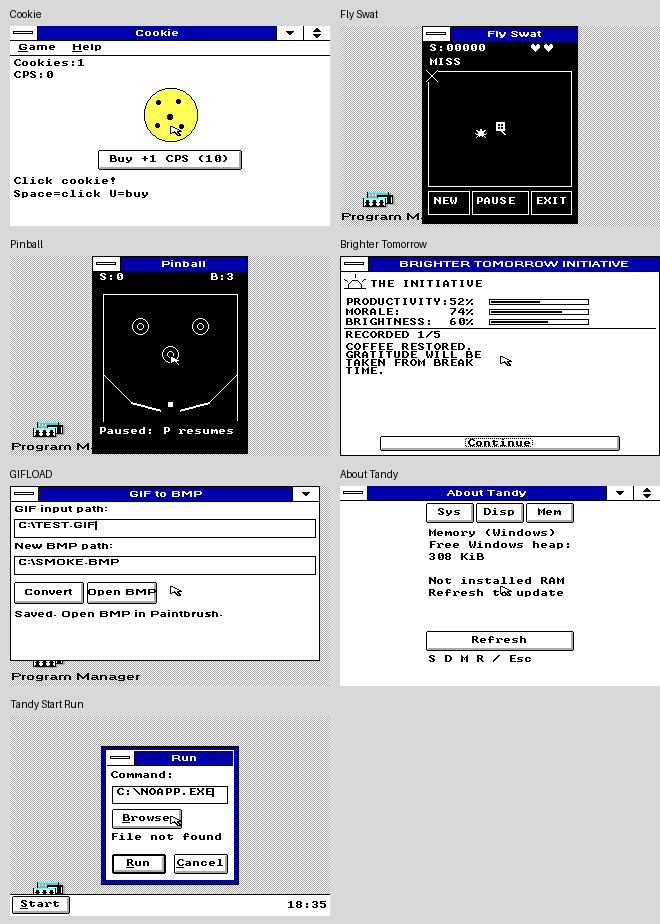

# Windows XT app polish 0.1

Seven modest presentation and feedback updates for the existing Windows 3.0 / 8088 apps. This is an **isolated optional trial**, with matching source and tests. Accepted examples, WINXT/TANDYLAB bundles, defaults, display drivers and fonts remain unchanged.

[Download APPUI01.ZIP](APPUI01.ZIP) · [Exact identities](SHA256.JSN) · [Qualification summary](SUMMARY.JSN)

## The changes

- **Cookie:** a brief one-pixel pressed state; clicking preserves useful save/purchase messages instead of replacing them with repeated “Click!” text.
- **Fly Swat:** the existing instruction row explains a miss or escaped fly, then returns to its usual instruction. The hot window procedure remains within C6's optimization limit.
- **Pinball:** one state-aware instruction strip replaces redundant prompts inside the playfield.
- **Brighter Tomorrow:** compact branding and space sized to the current phase's actual buttons. Decoration yields to notice text when the active font needs the room.
- **GIFLOAD:** Open BMP requires a successful conversion of the unchanged output path. Failed conversions and edited output fields cannot open a stale result.
- **About Tandy:** clearer free-Windows-heap wording and fewer redundant implementation notes; the distinction from installed RAM remains visible.
- **Tandy Start Run:** a plain Command label and readable common launch failures. The length bound and less-common numeric errors remain available when relevant.

## Try safely

Extract on the modern computer and copy `APPUI01/RUN` to a **new** folder on the Tandy. Start the existing Windows installation through its guarded launcher. Close an older instance before trying the new copy. Ordinary app controls and file behavior are described in the kit's README.

For **TSHELL**, use a disposable Program Manager guest with no Tandy Start instance already loaded. Keep the unchanged TSINPUT.DLL beside the EXE. A separate folder does not isolate an already-loaded Win16 module or the Windows-directory TSHELL.INI. This trial is not an installed-shell upgrade; preserve your existing shell and configuration.

Cookie saves only when requested, beside its EXE. GIFLOAD still needs a **new** output filename and refuses overwrites. The source-complete ZIP is not a mountable floppy image; the existing WINXT disk stays unchanged.

## What passed

- **41 accepted native emulator runs, 2,663 checks.** All seven exact production executables launch, exercise normal controls and close in each of the five graphics modes. GIFLOAD's flow verifies the named output, stale-path refusal and successful Paintbrush open/title/close.
- Separate source-inclusive native callers check Cookie state/save/feedback, Pinball cues, every Brighter Tomorrow choice/receipt/ending layout, GIFLOAD readiness errors, About values/geometry and Run limits.
- Swat's exact `/T` executable passes all five trial-alias GDI profiles plus a canonical 320×200×16 fast-renderer run. The latter restores both initial and canonical desktop bytes exactly in the recorded fixture.
- Unchanged game/codec cores pass 2,000,000 Pinball ticks, 2,000,000 sanitized Swat ticks, 136,884 Brighter Tomorrow assertions and 243 GIF cases. Current Hold/idle tests and the unchanged DLL contract pass.
- Scoped executable audits report no post-8088 suspects in the reached code. The portable QA wrapper was exercised with a byte-identical Pinball caller rebuild and native run.

The early narrow About wording failure, its passing retest, the Swat compiler correction and observer corrections are retained in the archive's `EVIDENCE/RETEST.JSN`. The older aggregate TSHELL host runner still points at an obsolete uppercase fixture and fails linking; current lowercase hook fixtures and the DLL verifier pass separately. That old runner is not reported as green.

## Limits and source

Runs use Windows 3.0 real mode, 640 KB, `8086_prefetch`, FPU off, and no EMS/XMS/UMB. Accelerated 200,000-cycle state tests and 25,000-cycle normal-use tests are **not calibrated physical 8088 performance**. No manual physical keyboard/mouse, real-Tandy endurance or forced low-memory acceptance is claimed. Existing EX/HX 640×200 four-color hardware uncertainty remains; custom fonts and hardware-text mode are outside this qualification.

The archive contains the exact seven app sources, unchanged TSINPUT source/runtime, period build inputs, native caller sources, host tests, raw-capture-derived PNGs and verification instructions. `PREVIEW.PNG` is a labelled contact sheet of untouched 320×200 frames, not repainted app artwork. Source baseline: `c6ee4b0`.

No Windows/DOS, compiler, SDK/DDK library, font, ROM or guest installation is included. Supply your own authorized tools and fixtures to rebuild. Existing provenance and notices remain; this package makes no new blanket license grant. Run `TESTPUB.PY` for read-only archive, manifest, source/runtime and payload checks.

## Supplementary capture-method check

The original PNGs are immediate diagnostic framebuffer samples and should not
be used alone as proof that every queued repaint has reached the ordinary
visible display. A [supplementary 320x200x4 video check](EVIDENCE/VIDEO/README.MD)
shows complete captions, fields and controls for all seven unchanged apps,
plus the Paintbrush handoff. All 41 observer checks passed. No APPUI01
missing-field regression or general driver defect was established.

The [untouched native recording](EVIDENCE/VIDEO/APP3204.AVI), exact decoded frames
and byte identities are preserved. The original kit, raw-derived preview,
original samples and qualification limits remain unchanged; no runtime rebuild
or promotion is part of this documentation follow-up.
