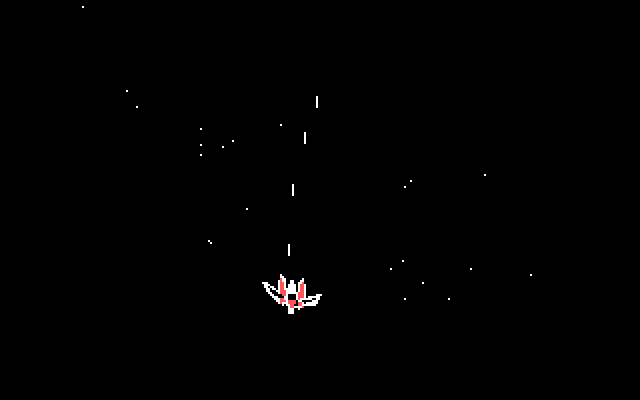
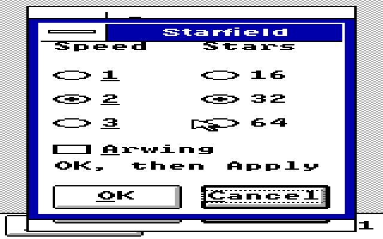

# Optional Arwing Starfield v0.1 test build

**Experimental public draft. Physical Tandy/joystick testing remains open.**
This isolated test kit adds an optional original fan-art ship, three banked
poses, calibrated joystick steering, automatic flight and bounded laser
fire. Plain Starfield remains the default. This publication replaces no
existing package, TSHELL/STARFLD executable, configuration, pin or workflow.

The GIF is actual final-runtime emulator footage using injected joystick
input. It is not a physical Tandy recording or an animation-speed promise.

## Download and the safest first preview

Download [ARWING01.ZIP](ARWING01.ZIP). It contains the exact matching
STARFLD.EXE and TSHELL.EXE, complete matching source and tests, notices,
screenshots and final qualification reports. No OS, display driver, font,
ROM, compiler or guest installation is included.

For an initial read-only preview, keep all installed files intact and copy
only `ARWING01/RUN/STARFLD.EXE` into a separate folder such as `C:\ARWTEST`.
Start Windows using the existing guarded WindowsXT launcher, normally
`C:\WINXT\WINXT`; do not bypass reservation/recovery errors. From Program
Manager File > Run, launch `C:\ARWTEST\STARFLD.EXE /S /R1`. Use `/S /R0`
for plain Starfield. Keyboard/mouse activity dismisses it; Escape works.

**A separate executable folder does not isolate configuration.** STARFLD
reads the Windows-directory TSHELL.INI. Ordinary `/S` preview does not write
it, but `/J` calibration Save writes its JoyCal value, and the matching
TSHELL's Apply writes shared saver settings. Test those paths first in a
disposable cloned Windows environment. Never copy synthetic test calibration
values into a hardware setup.

The [original kit guide](KITGUIDE.MD) describes optional manual integration
of the matching TSHELL/STARFLD pair and calibration. Its replacement steps
are not required for the separate-folder preview above. Before deliberately
testing integration on an existing setup, exit Windows and keep verified
backups of both existing executables and the Windows-directory TSHELL.INI.
Keep TSINPUT.DLL, display setup and the guarded launcher unchanged. Restore
those saved original files from plain DOS to undo that test. No automatic
installer or installation action is supplied by this publication.

## Controls and bounded work

- In matching TSHELL: System > Screen saver > Starfield > Options > Arwing.
  OK stages it; Preview tries it; Apply saves it. Arwing defaults off,
  with speed 2 and 32 stars retained.
- Without valid saved calibration or a valid joystick signal, the ship uses
  automatic flight. Missing calibration performs no joystick port I/O.
- Explicit `/J` calibration selects the port, collects both axis ranges,
  requires an explicit center and verifies the saved setting. Repeat after
  changing machine or timing conditions. Physical electrical behavior is
  untested.
- Either joystick button fires. Held fire has a cooldown and at most four
  live bolts. Disconnect stops firing and falls back to automatic flight.
- At most one bounded 512-sample port burst per requested 250 ms; interrupts
  are not disabled. No catch-up loop, busy-wait animation or sound ownership.
- Three pre-baked poses use tiny masked GDI bitmaps. Ordinary rendering
  performs no direct framebuffer writes, mode switches or runtime polygons.

## Verification and honest limits

The frozen kit's exact STARFLD/TSHELL pair passed five strict 640 KB real-mode
display modes, 24 exact scene checkpoints, 48 lifecycle cases, six foreign
cursor handoffs, four actual SDL held-input cases, two native settings suites
and two 35-check native calibration runs. Input coverage clearly distinguishes
injected controller values, actual SDL gestures and untested real hardware.

Publication independently rechecked all 135 internal manifest hashes,
171,873 joystick/module decoder assertions, 60,330 flight-model slices,
218 configuration assertions, exact generated sprite bytes and a scoped
8,437-instruction direct-control-flow audit with no post-8088 suspects.
Host tests use ASan/UBSan; LeakSanitizer is disabled for the test host.
The retained vintage rebuild was byte-identical to the shipped runtime.

Test-only `/D2` reads B800 video memory and writes scene dumps. Native GUI
harnesses deliberately modify clone settings and exit Windows; use them
only in disposable fixtures, never as normal saver launch options.

The broader legacy TSHELL aggregate still has an existing IDLE/HOSTTEST
WinAPI-stub link failure; it is not presented as a full aggregate pass.
See [TESTS.MD](TESTS.MD) for precise retained evidence and audit exclusions.

At an uncalibrated 1,500-cycle emulator preset, the largest sampled Arwing
render slice was 165 ms. The requested 55 ms timer and 165 ms flight interval
are not guaranteed rates. Physical 8088 speed, joystick timing, endurance
and forced low-memory faults remain untested. 640x200x4 is four colors;
emulator results do not establish original EX/HX mode 0Ah behavior.

## Rebuild, provenance and package identity

Unpack the ZIP before following its relative source commands. Matching
STARFLD source is under `ARWING01/SOURCE/STARFLD`, complete TSHELL source is
under `ARWING01/SOURCE/TSHELL`. Supply your own authorized vintage tools and
Windows fixture. Pure host checks need no Windows, hardware I/O or installed
configuration. No broad source-delta directory or host test binary is added.

`python3 experiments/ARWING01/TESTPUB.PY` verifies the exact ZIP, all internal
hashes, the two qualified runtime pins, docs and allowed file inventory.
[SHA256.JSN](SHA256.JSN) records downloadable artifact identities.

The exact 2026-10-05 private-delivery archive is preserved unchanged. Its
original "private" and "not published" text describes preparation time;
this directory records public experimental publication. Source baseline is
`62f46b2404233f02f548d314ed05fd505bca1fa5`.

The ship is original geometric fan art inspired by Star Fox's Arwing.
There are no extracted Nintendo ROM assets, models, sounds, logos or game
code. [NOTICE.TXT](NOTICE.TXT) retains the original-contribution MIT notice
and Nintendo attribution; it does not grant rights in the underlying
characters/trademarks. The exact EXJOY MIT license is preserved inside
`ARWING01/SOURCE/STARFLD/SOURCE/JOYLIC.TXT`. No new third-party rights are
asserted and no affiliation or endorsement is implied.
