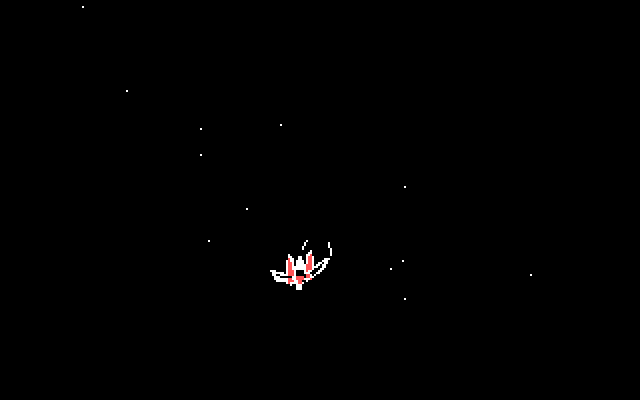

# Arwing Starfield v0.2: lasers toward the horizon

**Experimental correction; plain Starfield and installed defaults remain
unchanged. Physical Tandy/joystick speed is still unqualified.**

Bolts now launch from alternating bank-aligned wing tips, converge toward
the starfield's central vanishing point, shrink with distance and disappear
near the horizon. They no longer fly to the top edge. Ship movement, art,
joystick calibration, four-bolt cap, cooldown and settings remain unchanged.
No enemies, scoring, sound or other gameplay were added.

The GIF is actual qualified runtime footage at an uncalibrated 25,000-cycle
emulator setting, not physical 8088 speed. Slow-preset held-fire stress can
visibly pause; see the separate timing comparisons below.

## Download and preview separately

[ARWING02.ZIP](ARWING02.ZIP) contains the exact selected runtime, matching
source/tests, notices and qualification evidence. Its unchanged TSHELL.EXE
is included for compatibility. The [v0.1 experiment](../ARWING01/README.MD)
and its exact fallback kit remain intact. This publication changes no
existing app, driver, default, WINXT/FRESH14 pin, stable package or workflow.

For a first preview, put only `ARWING02/RUN/STARFLD.EXE` in a separate folder
such as `C:\ARWING02`. Start Windows through the existing guarded WindowsXT
launcher, normally `C:\WINXT\WINXT`; never bypass reservation/recovery errors.
Program Manager File > Run: `C:\ARWING02\STARFLD.EXE /S /R1`.
Use `/S /R0` for plain mode. Keyboard/mouse activity or Escape dismisses it.
Without valid calibrated input, automatic flight takes over; either
joystick button fires when calibrated input is valid.

**A separate folder does not isolate settings.** Ordinary `/S` preview is
read-only, but `/J` calibration Save and TSHELL Apply write the shared
Windows-directory TSHELL.INI. Try those operations in a disposable cloned
guest first. Do not copy synthetic test calibration onto hardware.

For deliberate integration into an existing v0.1 setup, exit Windows and
back up the installed STARFLD.EXE, then replace only that executable at its
configured location. TSHELL.EXE, settings, TSINPUT.DLL, guarded launcher,
drivers and fonts need no replacement. Restore the saved v0.1 STARFLD.EXE
from plain DOS for rollback. For older setups, follow the matching-pair and
backup instructions in [KITGUIDE.MD](KITGUIDE.MD). No installer runs here.

## Performance: two different workloads

The fair paired diagnostic fixtures used the same uncalibrated 1,500-cycle
preset, stationary centered 320x200x16 scene, 77 flight updates, 151 star
updates, ten shot births and at most four bolts. Both forced the same
timer-frame schedule only for that comparison; their rendering code was
unchanged. These were controlled fixture variants, not the shipped EXEs.

- v0.1 elapsed: 16.972 seconds; v0.2: 17.741 seconds, about 4.53% longer
- Maximum paired render slice: 220 ms versus 275 ms
- Cumulative render: 7.366 seconds versus 8.295 seconds

The v0.1 report's earlier 165 ms maximum was autoflight with an absent
joystick, not firing. It must not be compared with active-fire stress.
[Matched inputs](EVIDENCE/PAIRINPT.JSN), [old results](EVIDENCE/PERFOLD.JSN),
[new results](EVIDENCE/PERFNEW.JSN).

Separate selected-runtime moving/held-fire stress at 1,500 cycles reached
550 ms for a 320-color render slice and 385 ms in 640 four-color/monochrome.
It can visibly pause in that slow preset. Windows' roughly 55 ms clock
granularity, requested timers and emulator cycle settings do not establish
hardware latency or a guaranteed frame rate. No physical timing claim.

## Qualification and source

The frozen exact STARFLD passes all five modes: 160x200x16, 320x200x16,
320x200x4, 640x200x4 and 640x200x2. Evidence includes 200 corner/bank scene
checkpoints plus four normal-flight checkpoints, fifteen cursor handoffs,
32 repeated lifecycle cases and two actual SDL held-input reruns. Pixel
equality is checkpoint coverage, not a proof of every possible frame.

Publication independently reran 261,795 checked flight-model slices,
4,802 exact production-raster/reference cases and 171,873 unchanged
joystick checks with C89/ASan/UBSan, plus the scoped 9,013-instruction audit
with no post-8088 suspects. LeakSanitizer is disabled on the test host.
The 16-byte mask renderer uses at most seven coalesced solid patches per
bolt, with bounded 8x8 writes. One frozen-source repair comment still says
"two rectangles"; the selected implementation and tests establish seven
patches. Discarded line/bitmap prototypes are excluded.

Only production STARFLD.C, STFLY.C and STFLY.H changed from v0.1. TSHELL,
settings, joystick source, source art and rights notices are byte-identical.
The current-source build pins, full evidence and bounded host tests are in
the source-complete ZIP. [Change identities](EVIDENCE/CHANGES.JSN) and
[full qualification](TESTS.MD). Existing v0.1 native settings/calibration
results are not relabelled as new v0.2 runs.

Diagnostic `/D2` and `/D3` runs inject controls/read B800 fixture memory and
write scene dumps. They are test-only, not ordinary launch options or
general-driver assumptions. Normal saver rendering uses GDI. Original EX/HX
640x200 four-color behavior, real joystick electrical compatibility, long
endurance and forced low-memory behavior remain unqualified.

## Preserved notices and verification

[NOTICE.TXT](NOTICE.TXT) preserves original geometric fan-art/code attribution
and Nintendo non-affiliation. The exact EXJOY MIT notice remains under
`ARWING02/SOURCE/STARFLD/SOURCE/JOYLIC.TXT`. No new rights in Nintendo
characters/trademarks are asserted. No ROM/extracted game asset, OS, font,
driver, compiler, guest installation, credentials or private user data is
included. Supply your own authorized vintage tools/fixture for rebuilding.

Run `python3 experiments/ARWING02/TESTPUB.PY` to verify the exact archives,
all 123 internal hashes, runtime/source pins and public evidence. Download
identities are in [SHA256.JSN](SHA256.JSN). This is an experimental draft,
not a default promotion or an automatic merge request.
