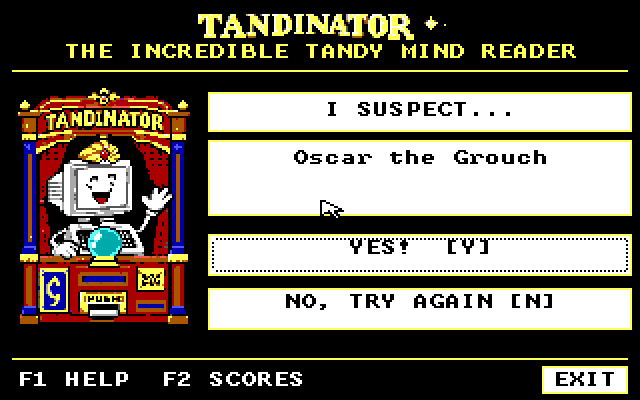

# TANDINATOR v0.3: experimental 256-character dataset trial

**Exploratory data, not an accuracy-qualified replacement for v0.2.**
The added 128 profiles are **77.16% UNKNOWN**; **200 pairs have no opposing
known trait**, and **18,926 cells remain general-knowledge/unverified**.
Even exact stored-answer replay gives **235/256 first guesses**, reaching
256/256 only when wrong guesses can be rejected. There has been **no human
playtest or independent accuracy validation of the new 128 profiles**.

This optional trial contains 256 characters, 130 questions and a 37,118-byte
database. It is published only under experiments/TANDI03. The existing
[v0.2 app and default](../../examples/TANDINAT/README.MD), original
128-character fallback, accepted packages and all workflows remain unchanged.

## What the figures mean

- Exact matrix replay: 235/256 first, 256/256 eventual; added profiles
  107/128 first, 128/128 eventual. All original 128 still first-guess
  correctly in the expanded matrix. Mean questions: 14.129 overall,
  19.023 for additions. Exact replay can need up to seven rejected guesses.
- Uncertain/soft stress: 2,696/3,072 first, 3,061/3,072 eventual.
- Mixed noise: 2,095/3,072 first, 2,881/3,072 eventual; for additions alone,
  790/1,536 first and 1,359/1,536 eventual.
- Single-flip-at-each-early-position stress: 1,722/2,560 first,
  2,534/2,560 eventual. The separate standard one-/two-wrong simulations
  recover 252/256 and 228/256 respectively, with failures retained.
- A 19-case sparse source-grounded diagnostic gives 4/19 first and 15/19
  eventual. **All 19 are original-roster characters; none tests an added
  profile.** It is selected diagnostic coverage, not a blind accuracy study.

The noise tests perturb authored rows with deterministic seeds. Uncertain/
soft uses 15% UNKNOWN and 30% softened definite answers; mixed noise uses
15% UNKNOWN, 5% reversals and 25% softened answers. Each has 12 seeds per
entry. Simulation permits up to ten rejected wrong guesses; normal UI has
no such rejection cap. These results are neither real-human accuracy nor
proof that the authored answers are true across different portrayals.
Read [QA.TXT](QA.TXT) and the [complete noise/failure report](EVIDENCE/HUMANSIM.JSON).

## Factual coverage and preserved fallback

The 33,280 cells comprise 13,115 UNKNOWN, 18,926 general/unverified,
941 explicitly tracked logical complements and 298 source-reviewed cells,
including interpretations and short excerpt-based checks. Overall UNKNOWN
is 39.41%. A source link, a unique profile or an UNKNOWN/value difference is
not independent factual verification or a decisive distinguishing trait.

The expanded matrix contains 53 targeted corrections to legacy traits and
two new discriminators. [Current integrated coverage](EVIDENCE/COVERAGE.JSON)
and [roster ambiguity audit](EVIDENCE/ROSTERAUDIT.JSON) expose the limits.
Historical ADDPROV.JSON inside the source archive records candidate-stage
provenance; COVERAGE.JSON is the current accounting.

The **BASE128 EXE, DAT and source remain byte-for-byte original**. Those
fallback bytes deliberately do not receive the 53 corrections. Fallback
is for recovery/comparison, not a claim of superior factual accuracy.
The scoring engine, database reader, normal UI/input and original native
art are unchanged. The new EXE differs only in explicit GUI self-test target
selection and a target-found diagnostic metric.

## Try separately; keep your current app

Download [TANDI03.ZIP](TANDI03.ZIP). Copy its `TANDI03/RUN/TANDI.EXE` and
`TANDI03/RUN/TANDY.DAT` together into a **new** folder such as `C:\TANDI03`.
Keep the existing v0.2 folder untouched. Close the other Tandinator copy
before testing a different version. Start Windows through the existing
guarded launcher, normally `C:\WINXT\WINXT`; do not bypass reservation or
recovery errors. Program Manager File > Run: `C:\TANDI03\TANDI.EXE`.

For the original fallback, keep the two `TANDI03/BASE128` files together in
a separate folder, such as `C:\TANDI128`, and launch its own TANDI.EXE.
Each EXE reads TANDY.DAT beside itself. Do not overwrite one database with
the other or remove your backup. [Fallback notes](FALLBACK.TXT).

The archived optional INSTALL.BAT targets C:\TANDINAT and refuses existing
files. It is not needed for this side-by-side trial. Nothing here installs
itself or edits Windows configuration, launchers or drivers. Ordinary play
stores no answers/learning history and uses no network. Explicit `/T` or the private WIN.INI `[TANDINATOR] Test=1` switch enables
self-tests that write diagnostic logs and framebuffer captures. Do not
leave synthetic test configuration enabled for ordinary play.

## Technical qualification, separately from data quality

Publication independently rebuilt the DAT byte-identically and reran:
53 compiler/corruption tests, 1,326 curation/provenance alignment checks,
eight art/framebuffer tests, sanitizer engine checks at 256 and 2,000 entries,
166,786 current-size and 2,562,256 maximum-size bounds checks, the scoped
emitted-code audit, roster/coverage accounting and every deterministic
noise/sparse diagnostic summary with its failures. These are technical or
consistency checks; they do not change the factual-coverage limits above.

The frozen kit retains fresh strict 640 KB real-mode Windows 3.0 runs in
320x200x16, 640x200x2 and 640x200x4, added-character guesses, input/replay,
dirty repaint/focus/pupil checks, three exit routes, original-data fallback,
2,000x256 synthetic scale and corrupt-DAT cases. The scale fixture is not
2,000 authored characters. [Review record](EVIDENCE/REVIEW.JSON).

No physical Tandy/CF install, actual cross-task Alt-Tab/Alt-F4 keypress test,
calibrated 8088 latency measurement or human playtest occurred. 160x200 is
unsupported; original EX/HX 640x200 four-color behavior remains a separate
driver caveat. Emulator timing is not physical hardware performance.

## Source, notices and identity

The exact corrected source-complete kit contains the matching project,
editable original curation, source-local audit fixtures and full evidence.
Source commit: `986c93db0f7764712761002066940ad563e9cb52`.
No Akinator database/API/question bank, GPL engine, copied portrait collection
or wholesale third-party article/source dump was imported. Names/trademarks
remain their owners' property. Existing original supplied art is unchanged;
its authorship/upstream license was not independently verified. Preserve
[NOTICE.TXT](NOTICE.TXT); this publication assigns no new artwork rights.

No Windows/compiler/BIOS/font/driver media or guest installation is packaged.
Some historical test helpers record build-workspace paths and require your
own authorized tools/media. Do not run one-time source-integration scripts
over the canonical data; follow the included BUILDING.TXT instead.

Run `python3 experiments/TANDI03/TESTPUB.PY` to verify the archive, all
246 internal hashes, both runtime pairs, unchanged fallback/art/engine pins,
headline dataset counts and matching public evidence. [SHA256.JSN](SHA256.JSN)
records identities. The original private-preparation wording inside the
immutable kit is historical; this page records public experimental status.
