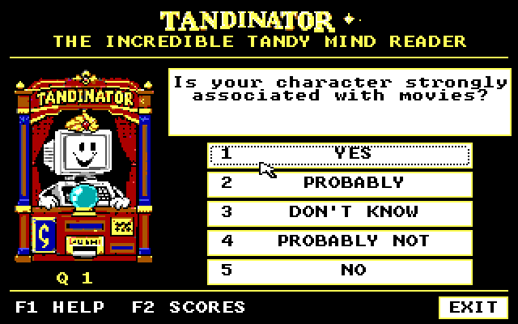

# TANDINATOR v0.3.1: text and answer-layout repair

**Experimental UI repair, not a default promotion or hardware release.**
The clipped initial "I" is restored. Numbers 1-5 use an independent
left-aligned column, only the answer labels are centered, and answer
buttons are about 23% narrower. Original artwork and moving eyes remain.

## Try it separately

[TANDI04.ZIP](TANDI04.ZIP) is the exact qualified, source-complete UI kit.
Copy its `TANDI04/RUN/TANDI.EXE` and `TANDI04/RUN/TANDY.DAT` together into
a new folder, such as `C:\TANDI04`. Keep the existing app and backups intact.
Close the other Tandinator copy first. Start Windows through the existing
guarded WindowsXT launcher, normally `C:\WINXT\WINXT`; never bypass
reservation/recovery errors. In Program Manager, File > Run:
`C:\TANDI04\TANDI.EXE`.

The original [v0.2 app](../../examples/TANDINAT/README.MD),
[v0.3 dataset trial and BASE128 fallback](../TANDI03/README.MD), defaults,
packages, drivers and release pins are unchanged. The older kit's BASE128
folder remains the simplest ready-to-run original fallback. This new ZIP
has no top-level BASE128 folder; its SOURCE/build contains recovery fixtures.
Do not mistake the inherited README's older BASE128 description for a new
folder or overwrite a working database to test the UI.

The optional archived installer targets C:\TANDINAT and refuses existing
files; it is unnecessary for this separate-folder preview. This publication
does not install anything, edit INIs or replace a launcher/driver. Ordinary
play makes no network requests and saves no answers. Explicit `/T`, or a
private WIN.INI `[TANDINATOR] Test=1` setting, enables file-writing diagnostics;
do not leave test configuration enabled for normal play.

## What changed

Questions/result names now wrap into individually measured lines. Trimmed
lines are centered with TextOut rather than the Windows 3.0 centered
DrawText word-wrap path that clipped the initial glyph. Existing inner
horizontal margins are retained and every line is checked for pixel fit.

Answer rectangles are 164 rather than 212 native 320-layout units wide.
At 640 horizontal resolution those widths are 328 and 424 pixels. The
number column is left-aligned independently of the centered label area.
Whole bordered rectangles remain clickable; shortcuts and focus behavior
are preserved. The pupil/eye code, original art/atlas, engine, DB reader
and 256-character DAT are byte-identical to the prior build.

## Current UI qualification

Fresh Windows 3.0 real-mode emulator runs pass 320x200x16, 640x200x2 and
640x200x4. Each checks all 130 question strings and 256 names, keyboard
shortcuts 1-5, both opposite corners of every answer button, a click just
outside, repeated rounds, rejection/replay, partial redraws, expose/focus
restoration and moving-eye boundaries. Eight artwork checks pass, including
exact native framebuffer fidelity. Original cabinet/parts pixels are retained.

Publication independently reran the packaged UI/art checks against those
frozen captures, 53 compiler/corruption tests, 1,326 curation alignment
checks, a byte-identical DAT rebuild and the emitted-code audit.
[UI04.TXT](UI04.TXT), [UITEST.JSON](EVIDENCE/UITEST.JSON) and
[ARTUI04.JSON](EVIDENCE/ARTUI04.JSON) qualify the new executable.

Older QA/README text inside the unchanged ZIP describes v0.3 and its former
EXE; it is retained as historical dataset/background documentation, not
relabelled as a new UI run. Private/unpublished wording in UI04/LOCAL.TXT
describes original preparation; this directory records public test status.

This is emulator QA. Physical Tandy/CF operation, calibrated 8088 latency,
cross-task Alt-Tab/Alt-F4 behavior and long-running hardware acceptance remain
untested. 160x200 is unsupported. The 640x200 four-color profile retains the
existing original-EX/HX hardware caveat.

## Dataset quality did not change

The same 256-character, 130-question data remains exploratory: added
profiles are 77.16% UNKNOWN, 200 pairs have no opposing known trait, and
18,926 cells are general-knowledge/unverified. Exact authored-answer replay
was 235/256 first guesses and 256/256 eventual after rejected guesses;
noise tests have failures. The 19-case sparse diagnostic covers only the
original roster. No human accuracy validation or factual improvement is
claimed for this UI repair. See the [dataset trial](../TANDI03/README.MD).

## Reproduce checks and retain provenance

The kit preserves exact source based on expansion commit
`986c93db0f7764712761002066940ad563e9cb52`, with six changed/new UI-related
files. CRLF C source is preserved. Source-local data/audit fixtures are
included; vintage rebuilds need your own authorized toolchain/Windows media.

Run `python3 experiments/TANDI04/TESTPUB.PY` for artifact/source pins and
inventory checks. To recreate the captured-evidence layout in a fresh modern
host directory, run `python3 experiments/TANDI04/PREPQA.PY --out <new-path>`.
This copies only project source/runtime and evidence, never OS media. Then
run `python3 tests/ARTTEST.PY --require-runtime --runtime-tag=-ui04` and
`python3 tests/UITEST.PY` from that new path. Python/Pillow are host-only.
PREPQA uses BASELINE.PNG, the exact already-published v0.3 question capture
needed by UITEST's complete-I comparison; the immutable kit lacks that image.

[NOTICE.TXT](NOTICE.TXT) preserves original supplied-art provenance and
rights limitations. No new asset license or rights in third-party character
names are asserted. No Windows/compiler/BIOS/font/driver/guest media,
credentials or private correspondence are included. Artifact identities
are in [SHA256.JSN](SHA256.JSN).
