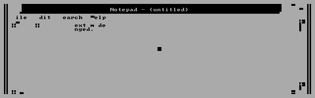

# Experimental Windows 3.0 hardware text-mode driver

**Feasibility proof only: not suitable for everyday use. Keep this out of normal Windows installations and OEM/Setup disks.** Nothing here replaces the accepted graphics driver, launcher, or default build.

Unchanged Program Manager and Notepad run in actual BIOS mode 03h: 80x25 B800 character/attribute cells, with 640x200 logical GDI pixels. Notepad text is readable and survives full repaint. The font transformer consumes only the owner's matching Windows font files; no Windows or ROM font bytes are supplied.

**Known failures:** window movement, sub-cell clipping and caret/inversion can damage text. Bitmap restore retains sampled GDI pixels but loses semantic characters (60 hardware-byte differences in the recorded test). Small Program Manager icon labels and arbitrary graphics are approximate. Accelerated emulator validation does not establish physical hardware performance or broad application compatibility.

Readable initial Notepad:

Known damaged text after bitmap restore:

Read [README.TXT](README.TXT) for isolated lab reproduction and limitations. Use only a disposable copy of your own Windows installation. The accepted driver and normal install path are untouched. Build with the original project inputs using `SOURCE/BUILD88.PY --repo <isolated-project> --mode 640x200x2 --dosbox <dosbox-x> --out <new-build>`. Never copy the experimental output into a normal installation.

- [Final native results and remaining failures](EVIDENCE/RESULT.JSON)
- [Native probe log](EVIDENCE/NATIVE.LOG)
- [Owned-font transformer](FIXFONT.PY)
- [Sealed standalone package](PROOF.ZIP)

## Publication and provenance

The source, first-party binaries, evidence and SHA256.JSON are byte-identical to the sealed standalone package. PROOF.ZIP is that complete unchanged package. SHA256.JSON describes its original members; it does not cover this added README or the archive itself.

Historical documents under SOURCE and build-only status fields are retained as provenance, not current acceptance claims. README.TXT and EVIDENCE/RESULT.JSON describe this experimental milestone. Build-only fields such as `runtime: NOT_TESTED` do not supersede the separately recorded native evidence, and older graphics-mode descriptions do not describe the final text-mode hardware state.

No Windows applications, installation media, fonts, BIOS ROM, SDK/DDK/compiler binaries, credentials, or private Library metadata are added. Local source and artifact integrity checks are separate from GitHub CI. No merge, tag, or release is part of this publication.

Standalone archive SHA256: `a0f116dd9f94047ece01680ede0db67ad08006fdbecf79a3a9f12a2aeb81502e`.
