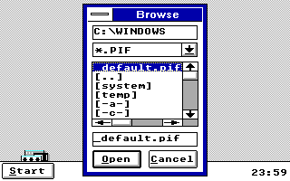

# TSHELL review fixes 0.1

An isolated experimental review packet for canonical Tandy Start 14. Existing examples, shipped Windows XT/TANDYLAB binaries, installers, INIs, defaults, driver/font payloads and the frozen APPUI01 trial remain unchanged.

[Download TSFIX01.ZIP](TSFIX01.ZIP) · [Readable source patch](FIXES.PATCH) · [Exact identities](SHA256.JSN) · [Qualification evidence](SUMMARY.JSN)

## Included corrections

- Browse permits Windows shutdown queries instead of accidentally vetoing them.
- Date Apply, saver Apply/Options/Preview and Starfield OK accept real Alt-mnemonic button notifications. Implicit Enter, disabled/inactive-dialog and deferred-preview safeguards remain.
- Program Manager uses G, leaving P for Programs.
- Browse includes PIF files and rejects invalid filter selections.
- The 40-group cap retains its page counter.
- The portable host runner uses the current idle/Hold fixtures.

Remembering the Browse filter was deliberately dropped: the retention-enabled variant stalled when reopening Browse. Restoring the original EXE-on-open default passed the same corrected external observer in all five modes. PIF remains selectable each time.

## Qualification

The final 68,451-byte TSHELL.EXE passed 80 exact-production checks in five graphics modes: secondary-bar launch, Run/Browse, PIF selection, shutdown query and canceled-session handling, complete cancellation, reopening both dialogs with the original EXE default, and clean close. The unchanged dialog modules passed 75 native substituted-action checks across those five modes. Those callers replace clock/configuration writes and preview/option actions with counters; they are not tests of actual writes.

Portable group/selector/lifecycle, date (306,822 checks), configuration (143), page-status (six), idle/Hold and unchanged-DLL checks pass. A scoped audit covers 22,293 reached instructions with no post-8088 suspects. Imported OS code and unresolved indirect paths are outside that audit.

Runs use Windows 3.0 real mode, 640 KB, 8086_prefetch, FPU off and no EMS/XMS/UMB. Exact observers use 25,000 cycles; dialog callers use 200,000. This is functional emulator evidence, not physical Tandy timing, manual keyboard/mouse or endurance acceptance. Primary-shell startup/Hold/saver/shutdown lifecycle was not fully rerun. Forced low memory, custom fonts and hardware-text mode remain outside this qualification; the existing EX/HX 640x200 four-color hardware caveat remains.

Failed, interrupted and superseded test attempts remain in the archive and summary. They are not counted among the 155 final native checks.

## Scope and safe use

This packet does not install or select a shell. Try its RUN directory only in a disposable Program Manager guest with no Tandy Start module already loaded. Keep unchanged TSINPUT.DLL beside TSHELL.EXE. Separate folders do not isolate Win16 module names or Windows-directory TSHELL.INI. Preserve configuration and do not copy over an installed shell or CF card as part of this trial.

FIXES.PATCH targets only five C files and the host-test runner at the pinned source base; it is supplied for review and is not applied by this packet. The ZIP contains complete matching source, period build inputs, native caller/observer source, portable tests, screenshots and evidence. Use your own licensed compiler/SDK and installed guest; none is included.

The canonical Run wording is retained. APPUI01 already provides optional friendlier Run errors and a simpler label; its frozen archive is untouched. The full triage explains deferred architecture/features and preserved safety choices, including stock TASKMAN, sound ownership, primary-shell identity, group validation and modal saver guards.

Run python TESTPUB.PY for a read-only archive/member/source/runtime check. Existing source notices apply; no new blanket license grant is asserted. No Windows/DOS, compiler, SDK library, font, ROM, guest installation, credentials or private user data is added.
