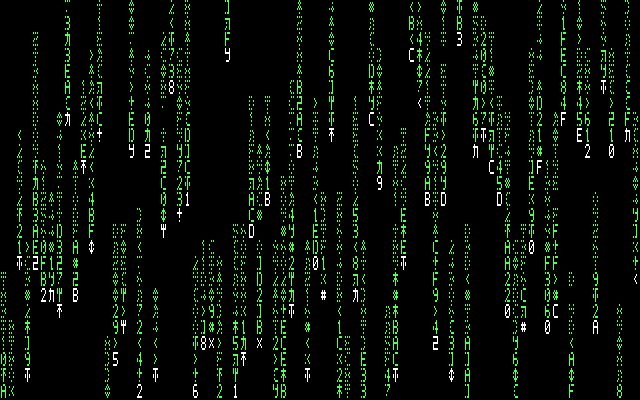
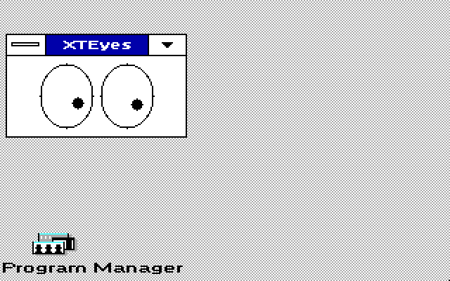

# Matrix and XTEyes: qualified visual polish

Ready first pair from the approved visual-demo pass. Other demos are being
qualified separately; this kit contains only MATRIX.EXE and XTEYES.EXE.

Matrix restores visible head/trail distinction in low-color GDI fallback.
A small precomputed atlas gives two patterned trail levels, with supported
green or cyan tint and a solid white head. Monochrome uses white. The native
framebuffer renderer and 16-color path are unchanged.

XTEyes uses a seventeen-entry integer table for rounder pupil travel. The
125 ms timer, hidden/stationary skips, window, artwork and interaction stay
the same. All pupil erase rectangles stay inside the original eye bitmaps.

## Preview

Use an existing guarded Windows 3.0 real-mode / WindowsXT installation.
Copy RUN's two executables to a separate test directory, then run them by
full path. MATRIX.EXE /S previews the saver; XTEYES.EXE opens the eye window.
No driver, launcher, INI, auto-start entry or installed app is replaced here.

## Checks

- Matrix: all three low-color GDI profiles complete 60 ticks with identical
  before/after elapsed, draw and worst-slice readings. At 25,000 emulator
  cycles, elapsed=6975 ms throughout; draw totals=274/329/220 ms for
  640x200x2, 640x200x4 and 320x200x4; maxima=165/165/110 ms.
- Matrix: 15 forced-GDI saver lifecycle cases pass, including held input,
  activation loss, Cancel, shutdown, repaint and stolen capture. Desktop
  samples restore exactly, capture is released and free memory is stable.
- Matrix: fallback live-memory increase is 2240 bytes in the paired runs.
- XTEyes: 206,241 actual-C geometry cases and 206,241 actual-bitmap safety
  cases pass, across all three eye sizes. No pupil rectangle reaches an outline.
- XTEyes: native 160-, 320- and 640-wide launch, pointer movement, cover,
  uncover, move, minimize, restore, close and reopen checks pass.
- XTEyes: the matched slow-emulator tracking fixture is unchanged: seven
  moving updates, 110 ms cumulative drawing, 55 ms maximum; reopening adds
  one zero-tick-resolution update in both builds.
- Period-tool builds and scoped 8088 ISA audits pass. The instruction audit
  is not proof of all external Windows routines or physical hardware timing.

EVIDENCE contains actual emulator frames and exact logs. Matrix frames use native DOSBox video presentation. EY*.PNG preserves
logical eye pixels; *-VIEW.PNG is a nearest-neighbor 640x400 display view. No image generation or UI mockup was used. Timers are measured
at roughly 55 ms granularity. Emulator cycles are not calibrated EX/HX speed.

## Source

Based on astrobleem/oemdisplay-tandy main
c6ee4b0f20d9a3c5da4b4d2b22bdc65a762c853b. Relevant source and build scripts
are under SOURCE. Exact eye QA/measurement sources are under CHECKS;
use these only in an owned cloned Windows fixture, since the test controller
launches its app from C:\WINDOWS. Build with your licensed period toolchain using BUILD.PY,
explicit --repo, --dosbox and a fresh --out directory. No Windows media,
compiler, driver or font binary is included. Existing source notices apply;
XTEyes' MIT notice is retained. SHA256.JSN seals every included file.

## Actual emulator frames

