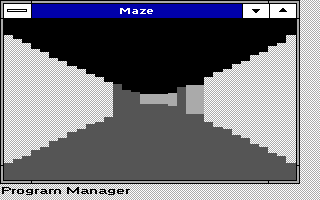
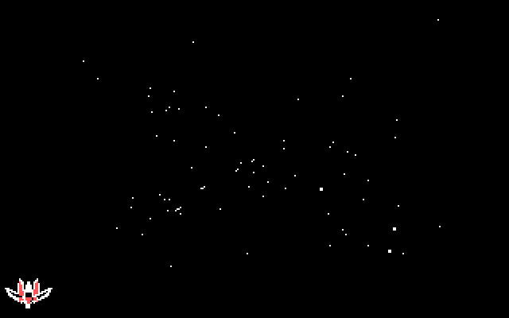
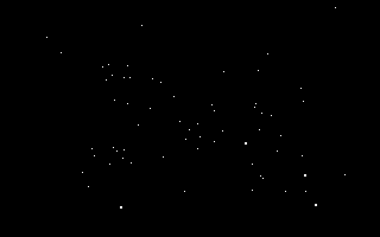

# Maze and Starfield: qualified visual polish

This opt-in second pair contains MAZE.EXE and STARFLD.EXE. Matrix and XTEyes
are in the separately qualified VISPART1 kit. The conditional Slosh surface
edge was measured and rejected; this kit does not replace Slosh.

## What changed

Maze's buffered first frame is built in four-ray slices. A temporary
"Drawing maze..." notice makes the wait explicit, and the message loop can
handle Close, Escape or resize between slices. Setup uses a 55 ms timer,
then restores the original 125 ms animation interval. Initial timer failure
reports an error and rejects creation instead of leaving a permanent notice.
The saver builds only the three packing masks actually used and slices its
GDI fallback clear. Ray geometry, movement and steady-state drawing remain
unchanged.

Plain Starfield repairs overlapping stars when one star's old rectangle is
erased. The existing Arwing02 option skips an old bolt repair rectangle only
when it is wholly inside the old ship rectangle already repaired. Ship art,
projection, firing, input, settings and scene pixels remain unchanged.
No new game mechanics or visual effects were added.

## Important trade-offs

- Windowed Maze's first complete scene takes 2.58 seconds rather than 1.65
  in the slow emulator fixture. The benefit is responsive, interruptible
  setup and a visible notice, not faster completion. Steady-state results
  remain eight frames in roughly ten seconds. The old synchronous direct
  drawing fallback remains if off-screen bitmap allocation fails; sliced
  startup is the buffered path.
- Maze saver setup improves from 329 to 110 ms. End-to-end 60-tick time is
  within one 55 ms clock tick of the baseline. Its reported draw-phase total
  and maximum are higher in this paired run (3131/110 versus 2910/55 ms), so
  this is not claimed as a steady-state rendering speedup.
- Arwing's identical fixed-input trace improves 2.3% in elapsed time and
  9.4% in the repair phase. The ordinary moving-fire stress still reaches
  a 550 ms worst slice. This small redundant-work reduction does not solve
  the worst stall.
- Slosh's one-pixel edge adds 5.5% cumulative drawing time and raises its
  worst paint from 1154 to 1264 ms in a matched stress fixture. That fails
  the negligible-cost condition, so it is omitted from ready executables.

These are deliberately slow emulator measurements, not calibrated 4.77 MHz
EX/HX timings. TESTS.MD contains exact workloads, hashes and limitations.

## Preview without changing an installation

Use an existing guarded Windows 3.0 real-mode / WindowsXT installation.
Copy RUN's two executables to a separate test directory and run by full path:

- MAZE.EXE: windowed demo. Escape closes; Space pauses.
- MAZE.EXE /S: saver preview; normal wake inputs dismiss it.
- STARFLD.EXE /S /R0: explicit plain Starfield preview.
- STARFLD.EXE /S /R1: existing optional Arwing preview.

These previews are read-only. No driver, launcher, auto-start entry, INI or
installed application is replaced by this kit. Keep accepted copies as backups.

Starfield /J Save and TSHELL Apply write the shared Windows-directory
TSHELL.INI even from a separate executable directory. Neither is required
here. There is no TSHELL update or synthetic calibration in this kit.

## Source and evidence

SOURCE contains the relevant first-party source and period build scripts.
Use BUILD.PY with explicit --repo, --dosbox and a fresh --out directory,
pointing to your licensed period toolchain. Run TESTHOST.PY with Python 3
and GCC for host-only checks. CHECKS/MAZEQA is a native startup controller
for an owned cloned Windows fixture; its hard-coded C:\WINDOWS paths are
for the test clone, not normal installation instructions.

EVIDENCE contains actual native frames, final logs, benchmark comparisons
and scoped ISA audits. *-VIEW.PNG is a nearest-neighbor 640x400 display view;
other decoded images preserve logical device pixels. No mockups were used.
TRIALS contains clearly labeled diagnostic source, not additional ready
programs. Do not use those synthetic workloads as application replacements.

No Windows media, compiler, driver or font binary is included. Existing
notices remain applicable. Arwing fan-art and joystick attribution are in
NOTICE.TXT and SOURCE/STARFLD/SOURCE/JOYLIC.TXT. SHA256.JSN seals the kit.

## Actual emulator frames

