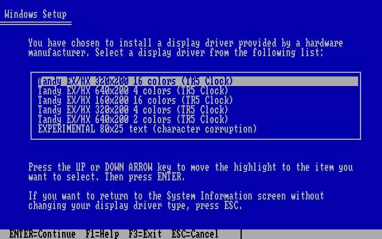
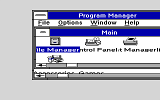

# 720 KB release verification

Verified 2026-10-05. These are emulator and host checks, not physical GoTek or
Tandy certification. The first GitHub Actions run found an old orphan-submodule checkout issue;
the workflow now uses an exact-commit anonymous checkout for this public repo.
The latest PR check records the remote-CI outcome.
The kit packages accepted TR5/runtime bytes; no display driver was changed.

## Published image and helper identities

- WINXT720.IMG: 737,280 bytes, SHA256
  `40e93a1f7dcc0ed8d2485d48f2fb25a316fea9860c7da76b0ec8254e3d1ce0ec`
- PREPXT.EXE: 26,181 bytes, SHA256
  `9a900898b1ae51969a7780433207f0015d2dc7030c6a3b9e68a3d590078fdf3f`
- PREPXT.C SHA256:
  `333815224d67a74cf1d3cdc3e71c8b22755372994893a3553c8cac02f356e2c4`
- Public disk free space: 60,416 bytes. Private own-media disk: 19,456 bytes.
- Complete staged runtime: exactly 46 files / 651,008 bytes.

See [the exact disk file list and allocation](EVIDENCE/PACKAGE.JSN).
Rebuilding after a source/instruction change can produce a new image hash;
verify the BUILD.JSON and SHA256SUMS accompanying that build.

## Host format and packaging tests

- TESTFAT.PY: 35 cases, 33 passed with DOSBox-X enabled. Two optional fsck.fat
  and mtools checks skipped because those tools were not installed.
- Both 720 and 360 KB formatter profiles mounted in real DOSBox-X. Nested,
  multi-cluster directories and multi-cluster binary contents were copied
  back byte-for-byte; mounted images remained unchanged.
- Boundary/corruption tests cover full/overfull media, root entry limits,
  invalid names, links, cycles, cross-links, FAT-copy differences, BPB fields,
  directory entries, file/slack/free-space corruption and exact source checks.
- TESTPKG.PY: 10 passed. Public output and portable-toolkit reproduction are
  byte-identical. Tests reject corrupt runtime, stale DOS pins, extra files,
  extra helper entries, private metadata and changed images/checksums.
- Workflow YAML parsed with expected PR/main/tag/manual triggers, only the
  read-only build job and explicit artifact files. Remote CI is a separate gate.

## DOS helper checks

`PREPXT.EXE` was built twice in fresh directories using `CL /AS /G0 /W3`;
outputs were byte-identical. No compiler tools or library archives are shipped.

All 22 cases in [the DOS matrix](EVIDENCE/DOSQA.JSN) passed under DOSBox-X:

- Original SZDD, expanded, already-complete private and mixed-directory inputs
- Missing, corrupt, wrong-version and conflicting candidate files
- Truncated headers/flags/literals/references, declared-size overflow,
  reference overrun and trailing compressed bytes
- Altered runtime/manifest, low disk space, declined confirmation,
  preexisting file/directory and DOS-version refusal
- Forced interruption after output began, leaving no runnable INSTALL.BAT

Additional checks passed for a repeated completed preparation, a runtime source
changed after validation, and both INT 2F Windows-session guard branches.
Every successful folder exactly matched the pinned manifest; every test checked
that Windows, source media and boot files stayed unchanged. INSTALL.NEW is
verified before its final rename to INSTALL.BAT.

The C SHA/SZDD routines also passed isolated address/undefined-behavior sanitizer
checks: 145 SHA vectors, literal/overlapping-ring SZDD cases, 26 malformed streams,
eight actual owned-media decodes and the exact privately derived font. Those host
checks complement the native 16-bit DOS runs; they do not replace them.

Final full preparation at 3,000 cycles took **251.43 seconds (4m11s)**. Profile:
normal core, 8086_prefetch, Tandy, 640 KB conventional memory, no FPU/EMS/XMS/UMB,
internal DOS reporting 3.30. This is emulator timing, not a measured 4.77 MHz
physical-machine time or a separately booted Microsoft MS-DOS 3.3 kernel.

Reproduce the source-only private matrix with QA.PY's explicit fixture arguments.
Its output contains copied owned Windows files and must never be published.
BENCH.C and the W1600/W4680 assembly files are optional test-only probes.
Normal DOS users need none of those tools or Python.

## Mounted public-image installation and recovery

A fresh public WINXT720.IMG was mounted as a write-protected **FAT12 floppy**,
not as a mapped host directory. The actual root INSTALL.BAT and PREPXT ran from
that image, gathered support from a disposable installed Windows fixture and
owned media folder, and produced the exact complete runtime. The image and all
Windows inputs remained unchanged. [Mounted-image result](EVIDENCE/MOUNTED.JSN).

The same prepared folder then completed the ordinary INSTALL.BAT -> guarded
WINXT SETUP path through native Windows 3.0 Setup. All six display choices were
listed; **TR53216** was selected for this fresh acceptance run. Setup installed
the correct EGA fonts; the no-CONFIG.SYS-changes option was selected. A cold restart used
the generated guarded WINXT launcher, opened Program Manager at 320x200 and
returned cleanly to DOS. [Native installation result](EVIDENCE/INSTALL.JSN).

A repeated installation refused safely. RESTORE YES restored all **27 files in
the numbered snapshot**, and a second restore remained byte-exact. This is not
a whole-drive backup: ordinary Program Manager .GRP layout updates are outside
that existing snapshot scope. Keep an independent backup of the machine.

Other graphics modes retain their previous acceptance evidence and unchanged
pins. This new end-to-end run did not freshly exercise every mode, optional
shell feature or application. Experimental hardware text keeps its documented
character damage. No physical floppy, GoTek/controller or original Tandy was
available for this release-packaging verification.
